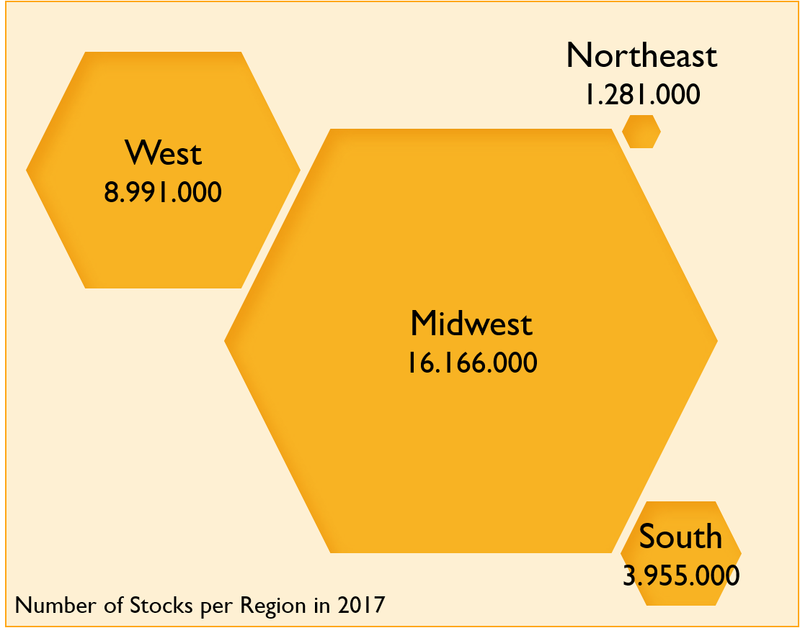
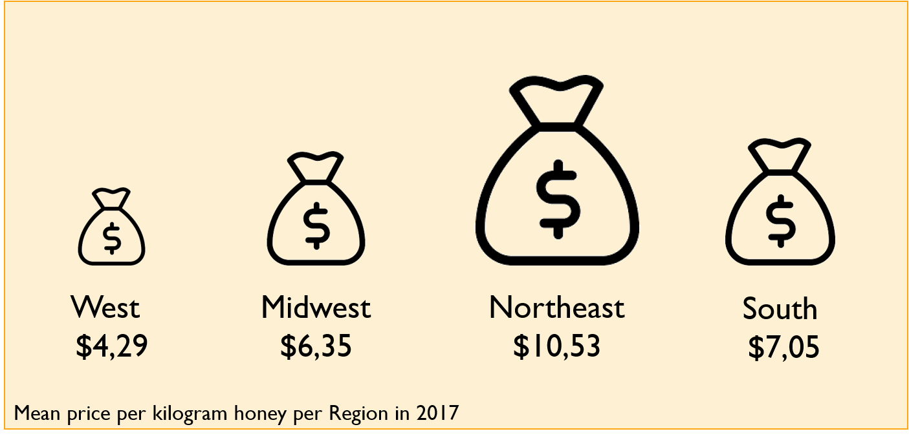
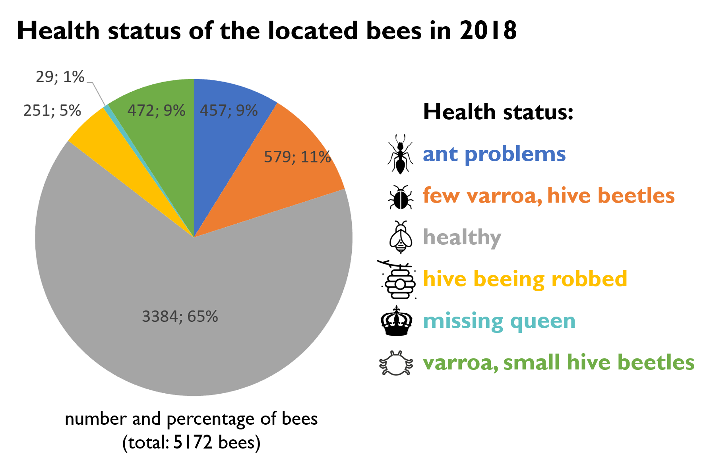
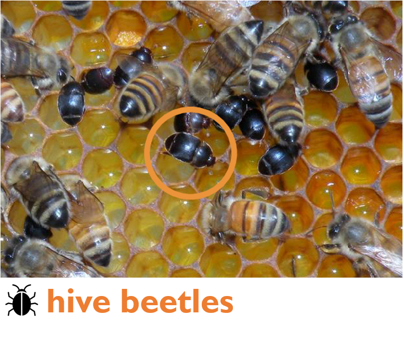
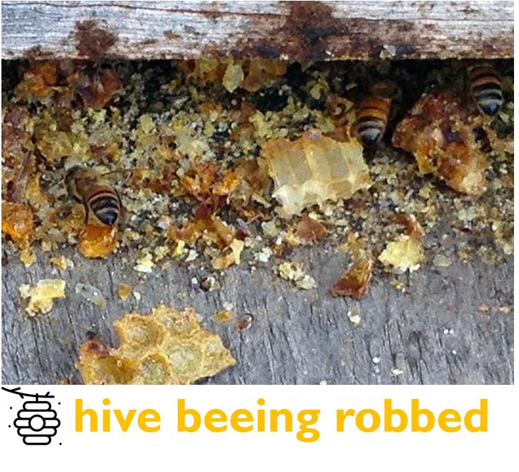

Bee interactive!
Fly through the story and discover the story of the bees!
```{r setup, include=FALSE}
knitr::opts_chunk$set(
	echo = FALSE,
	message = FALSE,
	warning = FALSE, 
	eval = FALSE
)

library(tidyverse, quietly = TRUE, warn.conflicts = FALSE) #because...duh
library(readxl)
library(viridis) #awesome color-blind friendly palette
library(janitor) #clean data
library(ggplot2)
library(knitr)
library(cowplot)
library(RColorBrewer)
library(measurements)
library(dygraphs)
library(flexdashboard)
library(plotly)
library(shiny)
library(psych)
library(DT)
library(rworldmap)
library(kableExtra)
library(gapminder)

#colorbrewer palette YlOrBr

honeyproduction <- read.csv(file="honeyproduction.csv", header=TRUE, sep=",")

#Umrechnen von Pfund in Kilogramm
honeyproduction <- honeyproduction %>% 
  mutate(yieldpercol_kg = conv_unit(yieldpercol, "lbs", "kg"),
         price_per_kg = priceperlb / conv_unit(1, "lbs", "kg"),
         totalprod_kg = conv_unit(totalprod, "lbs", "kg")
         )
#nomissing values 
#colSums(is.na(honeyproduction))
```

```{r, eval = TRUE}
#pesticides dataframe
pesticides <- read.csv(file="vHoneyNeonic_v03.csv", header=TRUE, sep=",")
#Umrechnen von Pfund in Kilogramm
pesticides <- pesticides %>% 
  mutate(yieldpercol_kg = conv_unit(yieldpercol, "lbs", "kg"),
         price_per_kg = priceperlb / conv_unit(1, "lbs", "kg"),
         totalprod_kg = conv_unit(totalprod, "lbs", "kg"),
         nAllNeonic_kg = conv_unit(nAllNeonic, "lbs", "kg")
         )
```


```{r, eval = TRUE}
# total_production <- merge(honeyproduction, pesticides, by=c("state", "numcol", "stocks", "price_per_kg", "prodvalue", "year", "yieldpercol_kg", "price_per_kg", "total_prod"))


total_production <- bind_rows(honeyproduction, pesticides) 

#remove duplicates by deleting missing N.A. row (region)
total_production <- total_production[!is.na(total_production$Region), ]
write.csv(total_production,"C:\\Users\\Anne\\Documents\\infovis_wallstreet73\\total_production.csv", row.names = TRUE)


```

```{r}
#region
sumregion_year <- total_production %>%
                group_by(Region, year, add = TRUE) %>%
  summarise(numcol = sum(numcol),
            stocks = sum(stocks),
            yieldpercol_kg = sum(yieldpercol_kg),
            #price_per_kg = sum(price_per_kg),
            #nAllNeonic_kg = sum(nAllNeonic_kg),
            totalprod_kg = sum(totalprod_kg)
            )


sumregion_total <- total_production %>%
                group_by(Region, add = TRUE) %>%
  summarise(numcol = sum(numcol),
            stocks = sum(stocks),
            yieldpercol_kg = sum(yieldpercol_kg),
            #price_per_kg = sum(price_per_kg),
            #nAllNeonic_kg = sum(nAllNeonic_kg),
            totalprod_kg = sum(totalprod_kg)
            )

meanregion_year <- total_production %>%
                group_by(Region, year, add = TRUE) %>%
  summarise(numcol = mean(numcol),
            stocks = mean(stocks),
            yieldpercol_kg = mean(yieldpercol_kg),
            price_per_kg = mean(price_per_kg),
            #nAllNeonic_kg = mean(nAllNeonic_kg),
            totalprod_kg = mean(totalprod_kg)
            )

meanregion_total <- total_production %>%
                group_by(Region, add = TRUE) %>%
  summarise(numcol = mean(numcol),
            stocks = mean(stocks),
            yieldpercol_kg = mean(yieldpercol_kg),
            price_per_kg = mean(price_per_kg),
            #nAllNeonic_kg = mean(nAllNeonic_kg),
            totalprod_kg = mean(totalprod_kg)
            )

pesticideregion_total <- total_production %>%
                group_by(Region, year, add = TRUE) %>%
  summarise(nAllNeonic_kg = mean(nAllNeonic_kg, na.rm = TRUE),
            nAllNeonic_kg = sum(nAllNeonic_kg)
            )

pesticide_total <- total_production %>%
                group_by(Region, #year,
                         add = TRUE) %>%
  summarise(AllNeonic_kg = sum(nAllNeonic_kg, na.rm = TRUE)
            )

sumstate_total <- total_production %>%
                group_by(StateName, add = TRUE) %>%
  summarise(numcol = sum(numcol),
            stocks = sum(stocks),
            yieldpercol_kg = sum(yieldpercol_kg),
            price_per_kg = sum(price_per_kg),
            totalprod_kg = sum(totalprod_kg)
            )

data2017 <-  sumregion_year[  sumregion_year$year=="2017" , ]

```


```{r data_beeimages, eval = TRUE}
# beeimages
bee_data <- read.csv(file="bee_data.csv", header=TRUE, sep=",")

summary(bee_data)
```


Column {data-width=350}
-----------------------------------------------------------------------

### The Problem of the Honeybee

```{r}
#hier eine plot grafik
```


### Bees - information beehind







#
```{r}
#hier infos über die biene
 
```


### Where did all the honey go?

```{r echo=FALSE, eval = TRUE}
honeyyear <- total_production %>%
  group_by(year) %>%
  summarise(YearTotal=sum(totalprod))
ggplot(data=honeyyear, aes(x=year, y=YearTotal/1000000, title = "How much honey did the USA produce between xx and xx?")) + 
  geom_smooth(method = "lm") + 
  geom_line(color = "#f3a328", size = 2) +
  geom_point() +
  scale_x_continuous(breaks=seq(1991, 2017, 3)) +
  ylab("Million kg Honey produced") + 
  xlab("years") +
  theme_bw()+
  background_grid(major = "xy", minor="y", size.major = 0.2) 
```


### textbox


```{r, eval = TRUE}
honeyperstate <- honeyproduction %>%
    group_by(state) %>%
    summarise(sumprod=sum(totalprod)) %>%
    arrange(sumprod) %>%
    mutate(percentage=round(sumprod/sum(sumprod)*100,2)) %>% 
    top_n(10)
    
ggplot(data=honeyperstate,
          aes(
              x=reorder(state,sumprod),
              y=sumprod/1000000
          )
       )+
       geom_col(aes(fill=state),show.legend=F)+
       geom_text(aes(label=percentage))+
       coord_flip()+
       labs(x="states of the USA",y="total honey produced (in million kg)",title="In which state were the honeybees most diligent?")  +
       background_grid(major = "xy", minor="y", size.major = 0.2) 
```


### A dramatic turn of... honey?

```{r paged.print=TRUE, eval = TRUE}
pesticides_year_production <- pesticides %>%
  group_by(year) %>%
  summarise(production_year=sum(totalprod_kg))

pesticides_year_neonics <- pesticides %>% 
  na.omit(nAllNeonic) %>% 
  group_by(year) %>% 
  summarise(neonics_year=sum(nAllNeonic))

pesticides_year_total <- merge(pesticides_year_production, pesticides_year_neonics)

ggplot(data=pesticides_year_total,aes(x = year, title = "Year 2000 - What happened to our honey?")
       ) + 
             geom_line(aes(y = production_year, colour = "Honey")) + 
             geom_line(aes(y = neonics_year*30, colour = "Neonic Pesticides")) + 
             scale_y_continuous(breaks=c(
                                          0, 10000000, 20000000, 30000000, 40000000, 50000000,
                                          60000000, 70000000, 80000000, 90000000, 100000000
                                        ),
                                labels=c("0", "10", "20", "30", "40", "50", 
                                         "60", "70", "80", "90", "100"
                                         ),
                                sec.axis = sec_axis(~./30,
                                                    name = "Amount of neonic pesticides 
                                                    applied in the US [million kg]",
                                                    breaks=c(0, 500000, 1000000, 1500000,
                                                             2000000, 2500000, 3000000, 3500000),
                                                    labels=c("0", "0,5", "1", "1,5", 
                                                             "2", "2,5", "3", "3,5")
                                                    )
                                ) +
  geom_point(aes(y = production_year, colour = "Honey")) + 
  geom_point(aes(y = neonics_year*30, colour = "Neonic Pesticides")) + 
  scale_colour_manual(values = c("cyan", "magenta")) + 
  labs(y = "Amount of honey produced in the US [million kg]", x = "Year", colour = "Parameter") +
  theme_bw()
```


```{r}
#https://plot.ly/r/map-subplots-and-small-multiples/ für die pesticides per state vieleicht? :)
```

### Honey honey honey, must be funny, in a rich man's world!

```{r}
ggplot(data = meanregion_year, aes(x = year, y = price_per_kg, color = Region)) +  
  scale_x_continuous(breaks=seq(1991, 2017, 5))+
  geom_line(aes(group = Region)) + geom_point()

```

```{r}
checkboxGroupInput(inputId = "checkGroup", 
                   label = "Region",
                   choiceNames = c("Northeast",
                                  "Midwest",
                                  "West",
                                  "South"),
                   choiceValues = c("Northeast",
                                  "Midwest",
                                  "West",
                                  "South")
                  )

renderPlot({
  
  ggplot(data = meanregion_year, aes(x = year, y = price_per_kg, color = Region)) +  
  scale_x_continuous(breaks=seq(1991, 2017, 5)) +
  geom_line(aes(group = Region)) + geom_point()
  
  
})
```


### colonies

```{r, }
total_production %>%
  select(year, totalprod_kg, numcol, yieldpercol_kg) %>% 
  group_by(year) %>% 
  summarize_each(funs(mean)) %>% 
  mutate(totalprod_kg_mio = totalprod_kg / 1000000) %>% 
  ggplot(aes(x = year, y = totalprod_kg_mio)) +
  geom_point(
    aes(
      size = numcol, 
      # fill = yieldpercol_kg),
    color = yieldpercol_kg),
    shape = 19
  ) +
  geom_smooth(span = 2, se = FALSE, color = "gray", linetype = "dotted") +
  scale_color_viridis(direction = -1, option = "A", name = "Yield per Colony\n(kg)") +
  # scale_y_continuous(limits = c(3000000, 5500000), breaks = c(3000000, 3500000, 4000000, 4500000, 5000000, 5500000), labels = c(3.0, 3.5, 4.0, 4.5, 5.0, 5.5)) +
  scale_x_continuous(limits = c(1992, 2017), breaks = c(1992, 1997, 2002, 2007, 2012, 2017)) +
  guides(size = guide_legend("Honey Producing\nColonies"), limits = c(55000, 65000)) +
  theme_minimal() +
  labs(title = "Total U.S. Honey Production Decreases", 
       x = "Year", 
       y = "US Honey Production (millions of kg)") +
  NULL

#save

ggsave("honey.png", last_plot(), height = 4, width = 6, units = "in", dpi = 600)
#default is last plot, but can name objects here
```

### buzy bees


```{r, eval = TRUE}

total_production %>% 
  select(Region, totalprod_kg, year) %>% 
  mutate(totalprod_kg_mio = totalprod_kg / 1000000) %>% 
  group_by(year, Region) %>% 
  summarise(totalprod_year_Region = mean(totalprod_kg_mio)) %>% 
  ggplot(aes(x = year, y = totalprod_year_Region, color = Region)) +
  geom_line() +
  theme_minimal() +
  labs(
    title = "default",
    x = "Blbbaskd",
    y = "blabla"
  ) -> p


ggplotly(p)

```


### Neonic Pesticides 

```{r}
#datatable(pesticides_year_total)
```

***
<h2>Neonicotinoids</h2>
<br>
<h4>Extract from "Neonicotinoid" on Wikipedia</h4>

"Neonicotinoids (sometimes shortened to neonics /ˈniːoʊnɪks/) are a class of neuro-active insecticides chemically similar to nicotine.[...] <br>
Imidacloprid is the most widely used insecticide in the world.[...] <br>
Most academic and governmental bodies agree that neonicotinoids have had a negative influence on bee populations." <br><br>

In a 2013, the European Food Safety Authority (EFSA) has been assigned by the European Union to conduct scientific research to the impact of neonicotinoids on honeybees. The studies findings stated that "neonicotinoids pose an unacceptably high risk to bees" and that previous research commissioned by insecticide manufacturers contained inexplicable data gaps. In response, the use of certain neonicotinoids has been restriced and tightend up over the years. 
In 2014, the US government under Barack Obama issued a blanket ban against the use of neonicotinoids on National Wildlife Refuges.
In 2018, the Trump administration reversed this decision.

The data shows a slight increase in use of neonic pesticides since 1994 and a strong rise starting in the early 2000s. At that time, besides imidacloprid, two other neonicotinoids, clothianidin and thiamethoxam, entered the market. After that point the amount of neonics applied rises drastically and only finally reaches a turning point in 2014, when neonicotinoids got restriced, and decreases by over 80%. 


### map 
```{r}
honeystates <- as.data.frame(table(total_production$StateName))

colnames(honeystates) <- c("StateName", mean="price_per_kg")

matched <- joinCountryData2Map(honeystates, joinCode="NAME", nameJoinColumn = "StateName")

mapCountryData(matched,
               nameColumnToPlot="price_per_kg",
               mapTitle="Price mean per state",
               mapRegion= "North America",
               catMethod = "pretty",
               colourPalette = "Greens")
```

```{r}
#https://plotly-r.com/maps.html 
# library(geojsonio)
# library(leafpop)
# tiles <- geojson_read("www/tiles.topo.json", what = "sp")
# tiles_sf <- st_as_sf(tiles)
# plot_ly(tiles_sf, split = ~StateName)
```

```{r}
density <- total_production[, "stocks"] / total_production[, "StateName"]

g <- list(
  scope = 'usa',
  projection = list(type = 'albers usa'),
  lakecolor = toRGB('white')
)

plot_geo() %>%
  add_trace(
    z = ~stocks, text = StateName, span = I(0),
    locations = StateName, locationmode = 'USA-states'
  ) %>%
  layout(geo = g)
```


###

```{r}
scatter_ggplot = 
  meanregion_year %>%
  ggplot(aes(x = year, y = price_per_kg, color = Region, fill= Region)) +
  geom_jitter(alpha = 0.88) +
  geom_line() +
  #scale__viridis() +
  coord_cartesian() +
  theme_classic()

ggplotly(scatter_ggplot)
```

###

```{r}
base <- total_production %>%
  plot_ly(x = ~price_per_kg, y = ~nAllNeonic_kg/1000, size = ~yieldpercol_kg, 
          text = ~Region, hoverinfo = "text") %>%
  layout()

base %>%
  add_markers(color = ~Region, frame = ~year, ids = ~nAllNeonic_kg) %>%
  animation_opts(1000, easing = "elastic", redraw = FALSE) %>%
  animation_button(
    x = 1, xanchor = "right", y = 0, yanchor = "bottom"
  ) %>%
  animation_slider(
    currentvalue = list(prefix = "YEAR ", font = list(color="red"))
  )
 

```


```{r}

total_production %>% 
  select(nAllNeonic_kg, price_per_kg, Region) %>% 
  mutate(nAllNeonic_t = nAllNeonic_kg / 1000) %>% 
  ggplot(aes(x = price_per_kg, y = nAllNeonic_t, color = Region)) +
  geom_point(alpha = 0.2) +
  facet_wrap(~Region, ncol = 2) +
  theme_grey() 

```


### 

```{r}

total_production %>%
  select(price_per_kg, Region, year) %>%
  group_by(Region, year) %>% 
  summarise(meanprice = mean(price_per_kg)) %>% 

  plot_ly(
    x = ~year, 
    y = ~meanprice,
    split = ~Region,
    # frame = ~year, 
    type = 'scatter',
    mode = 'lines', 
    line = list(simplyfy = F)
  ) %>% 
  layout(
    xaxis = list(
      title = "Year",
      zeroline = F
    ),
    yaxis = list(
      title = "Mean price in $ per kilogram honey",
      zeroline = F,
      ticketprefix = "$"
    )
  ) %>%

  animation_opts(
    frame = 100, 
    transition = 0, 
    redraw = FALSE
  ) %>%
  animation_slider(
    hide = T
    ) %>%
  animation_button(
    x = 1, xanchor = "right", y = 0, yanchor = "bottom"
  )

```

```{r}

# Create dataset
total_production %>%
  filter(year = 2017) %>% 
  select(Region, StateName, totalprod_kg) -> tmp

# Set a number of 'empty bar'
empty_bar=10

# Add lines to the initial dataset
to_add = matrix(NA, empty_bar, ncol(tmp))
colnames(to_add) = colnames(tmp)
tmp=rbind(tmp, to_add)
tmp$id=seq(1, nrow(tmp))

# Get the name and the y position of each label
label_data=tmp
number_of_bar=nrow(label_data)
angle= 90 - 360 * (label_data$id-0.5) /number_of_bar     # I substract 0.5 because the letter must have the angle of the center of the bars. Not extreme right(1) or extreme left (0)
label_data$hjust<-ifelse( angle < -90, 1, 0)
label_data$angle<-ifelse(angle < -90, angle+180, angle)

# Make the plot
p = ggplot(tmp, aes(x=as.factor(id), y=totalprod_kg)) +       # Note that id is a factor. If x is numeric, there is some space between the first bar
  geom_bar(stat="identity") +
  # ylim(-100,120) +
  theme_minimal() +
  theme(
    axis.text = element_blank(),
    axis.title = element_blank(),
    panel.grid = element_blank(),
    plot.margin = unit(rep(-1,4), "cm") 
  ) +
  coord_polar(start = 0) + 
  geom_text(data=label_data, aes(x=id, y=totalprod_kg, label=StateName, hjust=hjust), color="black", fontface="bold",alpha=0.6, size=2.5, angle= label_data$angle, inherit.aes = FALSE ) 

p

```


```{r}

empty_bar <- 10

to_add <- matrix(NA, empty_bar, 3)
colnames(to_add) <- names(total_production %>% select(Region, StateName, totalprod_kg))

total_production %>% 
  filter(year == 2017) %>% 
  select(Region, StateName, totalprod_kg) %>% 
  rbind(to_add) -> tmp

tmp$id <- seq(1, nrow(tmp))
tmp$id <- as.factor(tmp$id)

label_tmp <- tmp
number_of_bar <- nrow(label_tmp)
angle <- 90 - 360 * (label_tmp$id - 0.5) / number_of_bar
label_tmp$hjust <- ifelse(angle < -90, 1, 0)
label_tmp$angle <- ifelse(angle < -90, angle + 180, angle)

tmp %>% 
  arrange(Region, totalprod_kg) %>% 
  ggplot(aes(x = id, y = totalprod_kg, fill = Region)) +
  geom_bar(stat = "identity", alpha = 0.5) +
  # ylim(-100,120) +
  theme_minimal() +
  theme(
    legend.position = "none",
    axis.text = element_blank(),
    axis.title = element_blank(),
    panel.grid = element_blank(),
    plot.margin = unit(rep(-1,4), "cm")
  ) +
  coord_polar() + 
  geom_text(
    data = label_tmp, 
    aes(x = id, y = totalprod_kg + 10, label=StateName, hjust=hjust), color= "black", fontface = "bold", alpha = 0.6, size = 2.5, angle = label_tmp$angle, inherit.aes = FALSE ) +
  NULL
  
```


### Honey Bee Data (Images)


```{r}
ggplot(data = bee_data) +
  aes(x = location, y = subspecies) +
  geom_tile() +
  labs(title = "Which bees were found where?",
    x = "Where has the bee been located?",
    y = "What type subspecies was it?",
    subtitle = "bee-subspecies located in American cities") +
  theme_bw()
```


### beehive unnatural: Ssssssomething wrong with the bees?



What does it mean?







\begin{multicols}{1}

  \null \vfill
  \includegraphics[width=.3\textwidth]{www/healthybee.png}
  \vfill \null

\columnbreak

  \null \vfill
  \begin{itemize}
    \item text über die gesunde biene
  \end{itemize}
  \vfill \null
\end{multicols}

```{r}
ggplot(data = bee_data) +
  aes(x = health, y = subspecies) +
  geom_tile() +
  labs(title = "How healthy were the bees?",
    x = "health status",
    y = "What type subspecies was it?",
    subtitle = "healtstatus of the several bee subspecies") +
  theme_minimal()
```


### Impressum & Quellen nicht vergessen

