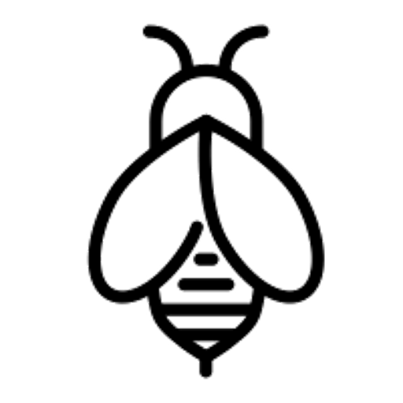
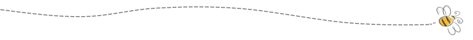
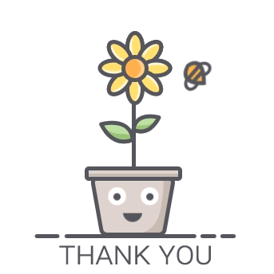

```{r setup, include=FALSE}
library(flexdashboard)
library(shiny)
library(tidyverse, quietly = TRUE, warn.conflicts = FALSE)
library(readxl)
library(viridis) #awesome color-blind friendly palette
library(janitor)
library(ggplot2)
library(knitr)
library(cowplot)
library(RColorBrewer)
library(measurements)
library(dygraphs)
library(flexdashboard)
library(plotly)
library(psych)
library(DT)
library(rworldmap)
library(kableExtra)
library(gapminder)
```

```{r}
#honeyproduction dataframe
honeyproduction <- read.csv(file="honeyproduction.csv", header=TRUE, sep=",")

#Umrechnen von Pfund in Kilogramm
honeyproduction <- honeyproduction %>% 
  mutate(yieldpercol_kg = conv_unit(yieldpercol, "lbs", "kg"),
         price_per_kg = priceperlb / conv_unit(1, "lbs", "kg"),
         totalprod_kg = conv_unit(totalprod, "lbs", "kg")
         )
#colSums(is.na(honeyproduction))
```


```{r, eval = TRUE}
#pesticides dataframe
pesticides <- read.csv(file="vHoneyNeonic_v03.csv", header=TRUE, sep=",")

#Umrechnen von Pfund in Kilogramm
pesticides <- pesticides %>% 
  mutate(yieldpercol_kg = conv_unit(yieldpercol, "lbs", "kg"),
         price_per_kg = priceperlb / conv_unit(1, "lbs", "kg"),
         totalprod_kg = conv_unit(totalprod, "lbs", "kg"),
         nAllNeonic_kg = conv_unit(nAllNeonic, "lbs", "kg")
         )
```


```{r, eval = TRUE}
#fuse both data frames 
total_production <- bind_rows(honeyproduction, pesticides) 

#remove duplicates by deleting missing N.A. row (region)
total_production <- total_production[!is.na(total_production$Region), ]
write.csv(total_production,"C:\\Users\\Anne\\Documents\\infovis_wallstreet73\\total_production.csv", row.names = TRUE)


```

```{r}
#region
sumregion_year <- total_production %>%
  group_by(Region, year, add = TRUE) %>%
  summarise(numcol = sum(numcol),
            stocks = sum(stocks),
            yieldpercol_kg = sum(yieldpercol_kg),
            priceperlb = mean(priceperlb),
            #price_per_kg = sum(price_per_kg),
            #nAllNeonic_kg = sum(nAllNeonic_kg),
            totalprod_kg = sum(totalprod_kg)
            )


sumregion_total <- total_production %>%
  group_by(Region, add = TRUE) %>%
  summarise(numcol = sum(numcol),
            stocks = sum(stocks),
            yieldpercol_kg = sum(yieldpercol_kg),
            #price_per_kg = sum(price_per_kg),
            totalprod_kg = sum(totalprod_kg)
            )

meanregion_year <- total_production %>%
  group_by(Region, year, add = TRUE) %>%
  summarise(numcol = mean(numcol),
            stocks = mean(stocks),
            yieldpercol_kg = mean(yieldpercol_kg),
            price_per_kg = mean(price_per_kg),
            #nAllNeonic_kg = mean(nAllNeonic_kg),
            totalprod_kg = mean(totalprod_kg)
            )

meanregion_total <- total_production %>%
  group_by(Region, add = TRUE) %>%
  summarise(numcol = mean(numcol),
            stocks = mean(stocks),
            yieldpercol_kg = mean(yieldpercol_kg),
            price_per_kg = mean(price_per_kg),
            #nAllNeonic_kg = mean(nAllNeonic_kg),
            totalprod_kg = mean(totalprod_kg)
            )

pesticideregion_total <- total_production %>%
  group_by(Region, year, add = TRUE) %>%
  summarise(nAllNeonic_kg = mean(nAllNeonic_kg, na.rm = TRUE),
            nAllNeonic_kg = sum(nAllNeonic_kg)
            )

pesticide_total <- total_production %>% 
  group_by(Region, #year,
                         add = TRUE) %>%
  summarise(AllNeonic_kg = sum(nAllNeonic_kg, na.rm = TRUE)
            )

sumstate_total <- total_production %>%
  group_by(StateName, Region, add = TRUE) %>%
  summarise(numcol = sum(numcol),
            totalprod_kg = sum(totalprod_kg)
            ) %>%
  arrange(desc(numcol))


sumstate_total2 <- total_production %>%
  group_by(StateName, Region, add = TRUE) %>%
  summarise(totalprod_kg = sum(totalprod_kg)) %>%
              arrange(desc(totalprod_kg))
            


data2017 <-  sumregion_year[  sumregion_year$year=="2017" , ]

```


```{r data_beeimages, eval = TRUE}
# beeimages
bee_data <- read.csv(file="bee_data.csv", header=TRUE, sep=",")
```

Start {data-icon="fa-home"}
=====================================  

Row {data-height=500}
-------------------------------------
###
<center><h3>Welcome to BEE AWARE!</h3></center>
Hello bee lover! You've found your way here through our logo on a honey product and would like to learn more about the bees in the US who are responsible for your honey. Click through the story of the bees and receive prepared scientific investigations around the bee and honey world. In addition, you can learn about the health of the bees and what is buzzing through the United States.
<p>
The development of honey production and the price of honey, habitat of bees, hazards for bees and, above all, which bees are there anyway? All this is shown by BEE AWARE.<p>
Fly off, there is a lot to discover!


### 
 

Row {data-height=200}
-------------------------------------
###
<h1 style="text-align: center; color: rgba(147, 197, 75, 1); letter-spacing: 5px; word-spacing: 10px; text-shadow: 2px 2px lightgrey;">
  Fly around and discover the story of the bees!
</h1>

Row {data-height=300}
-------------------------------------
###
<center>[{width=150px}](#general-information)</center>
<center>The Story</center>

### 
<center>[{width=150px}](#species)</center>
<center>The Honey Bee</center>


General Information {data-navmenu="Story"}
=====================================

Row {data-height=100}
-------------------------------------
### {.no-padding}
<h3>What is the current honey situation? - Information beehind</h3>

Row {data-height=500}
-------------------------------------
###


###


Row {data-height=500}
-------------------------------------
###


###


Row {data-height=100}
-------------------------------------
###

### {.no-padding}
<p style="text-align: right;">
 Which states produce the most honey?&nbsp;&nbsp;&nbsp;[{width=50px}](#top-honey-states)
</p>


Top honey states  {data-navmenu="Story"}
=====================================

Row {data-height=100}
-------------------------------------
### {.no-padding}
<h3>Which states produce the most honey?</h3>

Row {data-height=1000}
-------------------------------------
###
```{r, eval = TRUE}
myCol <- c("#FE8C01", "#FCA235", "#FAAC25", "#e5b740", "#dd9a65", "#F5BF2A", "#FDC601", "#FEE86B", "#FCDC27", "#F8B847")

honeyperstate <- total_production %>%
    group_by(StateName) %>%
    summarise(sumprod=sum(totalprod_kg)) %>%
    arrange(sumprod) %>%
    mutate(percentage=round(sumprod/sum(sumprod)*100,2)) %>% 
    top_n(10)
    
ggplot(data=honeyperstate,
          aes(
              x=reorder(StateName,sumprod),
              y=sumprod/1000000
          )
       )+
       geom_col(aes(fill=StateName),show.legend=F)+
       geom_text(aes(label=percentage))+
       coord_flip()+
       labs(
         title="Top 10 honey producing states from 1991 to 2017", 
         subtitle = "Percentage of the total production (bars) and total amount (x-axis)",
         x= "",
         y="total honey produced [million kg]"
         )  +
       scale_fill_manual(values = myCol) +
       background_grid(major = "xy", minor="y", size.major = 0.2) +
       theme_minimal() 
```

###
<strong>North Dakota - Honey El Dorado</strong><p>
```{r}
kable(sumstate_total2) %>%
  kable_styling(bootstrap_options = "striped", "hover", "condensed", "responsive", full_width = F, position = "float_right", fixed_thead = T)
```
            
<p>
As we have seen, a lot of honey was produced in the Midwest. And indeed, North Dakota was the main producer of honey between 1991 and 2017 and produced 16.83% oft he US honey yield (3,73 Mio kg honey). Here you can see what percentage of total honey from the years 1991-2017 contribute to the top 10 states.
<p>
The top 10 states are North Dakota (Midwest), California (West), South Dakota (Midwest), Florida (South), Montana (West), Minnesota (Midwest), Texas (South), Wisconsin (Midwest), Michigan (Midwest) and Idaho (West). These States make out around 74% oft the total production amount in 26 years. The other 34 states account for only about 26% of honey production.
<p>
To view the other states, you can scroll through the table here. 

Row {data-height=100}
-------------------------------------
### {.no-padding}
<p style="text-align: left;">
  [{width=50px}](#general-information)&nbsp;&nbsp;&nbsp;What is the current honey situation - information beehind
</p>

### {.no-padding}
<p style="text-align: right;">
  How does the honey spread across the country?&nbsp;&nbsp;&nbsp;[{width=50px}](#honey-production-map)
</p>


Honey Production Map {data-navmenu="Story"}
=====================================

Row {data-height=100}
-------------------------------------
### {.no-padding}
<h3>How does the honey spread across the country?</h3>

Row {data-height=800}
-------------------------------------
###


Row {data-height=200}
-------------------------------------
###
<strong>Honey Production in 2017</strong>
<p>
What is the influence of states on honey production? This map shows you the amount of honey produced in 2017. The area of a honeycomb corresponds to 100,000kg honey (values rounded up each time) and was arranged geographically. North Dakota and California stand out but also Montana, Florida and Texas take a clear size on the map. New York produces a lot of honey, despite its size. As seen before in the table, New York is just on rank 11 as the biggest honey producer of its region. The size of California is roughly proportional when you look at a US map. North Dakota, on the other hand, produces a lot of honey depending on its average land area. Of course, the card is just a simplification to get a feel for the benchmarks.
<p>The cartogram was created with tilegrams[7].

Row {data-height=100}
-------------------------------------
### {.no-padding}
<p style="text-align: left;">
  [{width=50px}](#top-honey-states)&nbsp;&nbsp;&nbsp;Which states produce the most honey? 
</p>

### {.no-padding}
<p style="text-align: right;">
  How did the honey production change over the past decades?&nbsp;&nbsp;&nbsp;[{width=50px}](#honey-production-over-time)
</p>


Honey production over time {data-navmenu="Story"}
=====================================

Row {data-height=100}
-------------------------------------
### {.no-padding}
<h3>How did the honey production change over the past decades?</h3>

Row {data-height=800}
-------------------------------------
### {.no-padding}
```{r, eval = TRUE}

total_production %>% 
  select(Region, totalprod_kg, year) %>% 
  mutate(totalprod_kg_mio = totalprod_kg / 1000000) %>% 
  group_by(year, Region) %>% 
  summarise(totalprod_year_Region = mean(totalprod_kg_mio)) %>% 
  ggplot(aes(x = year, y = totalprod_year_Region, color = Region)) +
  geom_line() +
  scale_color_manual(values=c("#e5b740", "#595242", "#975422", "#dc842a")) +
  theme_minimal() +
  labs(
    title="Amount of honey produced after regions",
    x = "year",
    y = "honey produced [million kg]"
  ) -> p


ggplotly(p)
```

###
```{r}
scatter_ggplot = 
  sumregion_year %>%
  ggplot(aes(x = year, y = numcol, color = Region, fill= Region)) +
  geom_point() +
  geom_line() +
  labs(
    title="Number of honey producing colonies after regions",
    x="year", 
    y="number of colonies in total") +
  #scale_viridis() +
  scale_color_manual(values=c("#e5b740", "#595242", "#975422", "#dc842a")) +
  scale_fill_manual(values=c("#e5b740", "#595242", "#975422", "#dc842a")) +
  coord_cartesian() +
  theme_minimal()

ggplotly(scatter_ggplot)
```

###
```{r}
kable(sumstate_total) %>%
  kable_styling(bootstrap_options = "striped", "hover", "condensed", "responsive", full_width = F, position = "center", fixed_thead = T)
```

Row {data-height=200}
-------------------------------------
###
<strong>Undisputed Midwest</strong>
<p>
The US is very diverse, so are their bees. That's why we look at what the bee world looks like in different regions. We can see that in all regions there has been a decreasing trend in honey production in the last 26 years (1991-2017). There is less and less honey produced, with some strong fluctuations. The northeast is the most stable region, but also produces the least amount of honey, as we saw in the beginning. Particularly dramatic is the honey yield in the west. And in the Midwest, where we found most bees and most honey before, annual honey production fluctuates most.

<br>
<strong>Number of honeyproducing colonies</strong>
<p>
If we compare that to the number of native honey bees in their colonies, we see a falling trend here as well. Here again the northeast is particularly stable. In 2004-2006, there was a strong impact on the number of bee colonies in the south and west. Fortunately, the numbers in the Midwest continue to rise since 2004.

<br>
<strong>Table</strong>
<p>
California was still in second place in the table with the top honey producers.
However, in terms of bee colonies, California beats North Dakota and is the state with the most bee colonies. The table also confirms the two diagrams, in which the number of colonies and amount of honey are very similar.
<p> numcol = Number of honeyproducing colonies, totalprod_kg = total production in kilogram


Row {data-height=100}
-------------------------------------
### {.no-padding}
<p style="text-align: left;">
  [{width=50px}](#honey-production-map)&nbsp;&nbsp;&nbsp;How does the honey spread across the country? 
</p>

### {.no-padding}
<p style="text-align: right;">
  Honey honey honey, must be funny, in a rich man's world!&nbsp;&nbsp;&nbsp;[{width=50px}](#honey-price)
</p>


Honey Price {data-navmenu="Story"}
=====================================

Row {data-height=100}
-------------------------------------
### {.no-padding}
<h3>Honey honey honey, must be funny, in a rich man's world!</h3>

Row {data-height=800}
-------------------------------------
###
```{r}
scatter_ggplot = 
  meanregion_year %>%
  ggplot(aes(x = year, y = price_per_kg, color = Region, fill= Region)) +
  geom_point() +
  geom_line() +
  labs(
    title="Price per kilo of honey after regions",
    x="year", 
    y="price per kg of honey [$]") +
  #scale__viridis() +
  scale_color_manual(values=c("#e5b740", "#595242", "#975422", "#dc842a")) +
  scale_fill_manual(values=c("#e5b740", "#595242", "#975422", "#dc842a")) +
  coord_cartesian() +
  theme_minimal()

ggplotly(scatter_ggplot)
```


```{r, eval = FALSE}
scatter_ggplot = 
  total_production %>%
  ggplot(aes(x = year, y = numcol/100000, color = StateName, fill= StateName)) +
  geom_point() +
  geom_line() +
  labs(
    title="Number of honeyproducing colonies after regions",
    x="year", 
    y="number of colonies in 100k") +
  #scale_viridis() +
  #scale_color_manual(values=c("#e5b740", "#595242", "#975422", "#dc842a")) +
 # scale_fill_manual(values=c("#e5b740", "#595242", "#975422", "#dc842a")) +
  coord_cartesian() +
  theme_minimal()

ggplotly(scatter_ggplot)
```


Row {data-height=200}
-------------------------------------
###
<strong>Honey - soon a luxury good? </strong>
<p>
We saw in the beginning that in the northeast of 2017 you had to pay up to \$10 per kilogram of honey. It wasn’t always like this. In 1991, honey costed just a whopping \$1,6 per kilo (\$0,72 per pound) in the northeast and only \$1,27 (\$0,58 per pound) in the west. After 2003, the honey price decreased for two years about 50 cent. Since then it went steeply uphill - except for the West, where the honey price has fallen since 2012 as a mere back to just under a dollar to "today".


Row {data-height=100}
-------------------------------------
### {.no-padding}
<p style="text-align: left;">
  [{width=50px}](#honey-production-over-time)&nbsp;&nbsp;&nbsp;How did the honey production change over the past decades? 
</p>

### {.no-padding}
<p style="text-align: right;">
  How did the amount of colonies and their yield change over the years?&nbsp;&nbsp;&nbsp;[{width=50px}](#colony-productivity)
</p>


Colony Productivity {data-navmenu="Story"}
=====================================

Row {data-height=100}
-------------------------------------
### {.no-padding}
<h3>How did the amount of colonies and their yield change over the years?</h3>

Row {data-height=1000}
-------------------------------------
###
```{r, }
#colonyplot=
  total_production %>%
  select(year, totalprod_kg, numcol, yieldpercol_kg) %>% 
  group_by(year) %>% 
  summarize_each(funs(mean)) %>% 
  mutate(totalprod_kg_mio = totalprod_kg / 1000000) %>% 
  ggplot(aes(x = year, y = totalprod_kg_mio)) +
  geom_point(
    aes(
      size = numcol, 
    color = yieldpercol_kg),
    shape = 19
  ) +
  geom_smooth(span = 2, se = FALSE, color = "gray", linetype = "dotted") +
  scale_color_viridis(direction = -1, option = "A", name = "Yield per Colony\n(kg)") +
  scale_x_continuous(limits = c(1992, 2017), breaks = c(1992, 1997, 2002, 2007, 2012, 2017)) +
  guides(size = guide_legend("Honey Producing\nColonies"), limits = c(55000, 65000)) +
  theme_minimal() +
  labs(title = "Total U.S. Honey Production Decreases", 
       x = "", 
       y = "Average honey production of a US state [million kg]") +
  NULL

#ggplotly(colonyplot)
#ggsave("honey.png", last_plot(), height = 4, width = 6, units = "in", dpi = 600)
```

###
<strong>Downtrend</strong>
<p>
Let's take a look at the whole US and its honey. In the last 26 years, a clear trend has been seen from large colonies with high yields to large colonies with small yields. Thus not only the total honey production decreases, but also the respective yield of the colonies. The bee colonies are therefore weaker overall in their work. Between 2000 and 2009 it can be seen that the number of bee colony has decreased significantly but still a medium to high amount per colony was produced.

Row {data-height=100}
-------------------------------------
### {.no-padding}
<p style="text-align: left;">
  [{width=50px}](#honey-price)&nbsp;&nbsp;&nbsp;Honey honey honey, must be funny, in a rich man's world! 
</p>

### {.no-padding}
<p style="text-align: right;">
  Where did all the honey go?&nbsp;&nbsp;&nbsp;[{width=50px}](#honey-production-decline)
</p>


Honey Production Decline {data-navmenu="Story"}
=====================================

Row {data-height=100}
-------------------------------------
### {.no-padding}
<h3>Where did all the honey go?</h3>

Row {data-height=1000}
-------------------------------------
###
```{r echo=FALSE, eval = TRUE}
honeyyear <- total_production %>%
  group_by(year) %>%
  summarise(YearTotal=sum(totalprod))

ggplot(data=honeyyear, aes(x=year, y=YearTotal/1000000, title = "How much honey did the USA produce between 1991 and 2017?")) + 
  geom_smooth(method = "lm", color = "#975422") + 
  geom_line(color = "#f3a328", size = 2) +
  geom_point() +
  scale_x_continuous(breaks=seq(1991, 2017, 5)) +
  labs(x="year",
       y="total honey produced [million kg]") + 
  theme_minimal()+
  ggtitle("How much honey did the USA produce between 1991 and 2017?") +
  background_grid(major = "xy", minor="y", size.major = 0.2) 
```

###
<strong>Dry spell</strong>
<p>
Now that we have looked at the different states and regions, we can expect the overall situation around honey in the USA.
<p>
So you can see that after 220 million kilograms around 1991 now only about 150 million kilograms of the bees was produced. It is therefore to be expected that there will be less honey in the next few years. What could be the reason?

Row {data-height=100}
-------------------------------------
### {.no-padding}
<p style="text-align: left;">
  [{width=50px}](#colony-productivity)&nbsp;&nbsp;&nbsp;How did the amount of colonies and their yield change of the years? 
</p>

### {.no-padding}
<p style="text-align: right;">
  A dramatic turn of... honey?&nbsp;&nbsp;&nbsp;[{width=50px}](#honey-and-neonic-pesticides)
</p>


Honey and Neonic Pesticides {data-navmenu="Story"}
=====================================

Row {data-height=100}
-------------------------------------
### {.no-padding}
<h3>A dramatic turn of... honey?</h3>

Row {data-height=1000}
-------------------------------------
###
```{r paged.print=TRUE, eval = TRUE}
pesticides_year_production <- pesticides %>%
  group_by(year) %>%
  summarise(production_year=sum(totalprod_kg))

pesticides_year_neonics <- pesticides %>% 
  na.omit(nAllNeonic) %>% 
  group_by(year) %>% 
  summarise(neonics_year=sum(nAllNeonic))

pesticides_year_total <- merge(pesticides_year_production, pesticides_year_neonics)

ggplot(data=pesticides_year_total,
                 aes(x = year)
                 ) + 
             geom_line(aes(y = production_year, colour = "Honey")) + 
             geom_line(aes(y = neonics_year*30, colour = "Neonic Pesticides")) + 
             scale_y_continuous(breaks=c(
                                          0, 10000000, 20000000, 30000000, 40000000, 50000000,
                                          60000000, 70000000, 80000000, 90000000, 100000000
                                        ),
                                labels=c( 
                                         "0", "10", "20", "30", "40", "50", "60", "70", "80", "90", "100"
                                         ),
                                sec.axis = sec_axis(~./30,
                                                    name = "Neonics applied in the US [million kg]",
                                                    breaks=c(0, 500000, 1000000, 1500000,
                                                             2000000, 2500000, 3000000, 3500000),
                                                    labels=c("0", "0,5", "1", "1,5", 
                                                             "2", "2,5", "3", "3,5")
                                                    )
                                ) +
  geom_point(aes(y = production_year, colour = "Honey")) + 
  geom_point(aes(y = neonics_year*30, colour = "Neonic Pesticides")) + 
  scale_colour_manual(values = c("#e5b740", "green")) + 
  labs(y = "Honey produced in the US [million kg]", x = "Year", colour = "Parameter") +
  ggtitle("Comparison of honey production and neonicotinoid application") +
  theme_minimal()
```

###
<strong>Risk for the bees</strong>
<p>
In a 2013, the European Food Safety Authority (EFSA) has been assigned by the European Union to conduct scientific research to the impact of neonicotinoids on honeybees. The studies findings stated that "neonicotinoids pose an unacceptably high risk to bees" and that previous research commissioned by insecticide manufacturers contained inexplicable data gaps. In response, the use of certain neonicotinoids has been restriced and tightend up over the years. 
In 2014, the US government under Barack Obama issued a blanket ban against the use of neonicotinoids on National Wildlife Refuges. In 2018, the Trump administration reversed this decision.[13]
</p>

<strong>Rise of the Neonicotinoids</strong>
<p>
The data shows a slight increase in use of neonic pesticides since 1994 and a strong rise starting in the early 2000s. At that time, besides imidacloprid, two other neonicotinoids, clothianidin and thiamethoxam, entered the market. After that point the amount of neonics applied rises drastically and only finally reaches a turning point in 2014, when neonicotinoids got restriced, and decreases by over 80%. 
</p>

Row {data-height=100}
-------------------------------------
### {.no-padding}
<p style="text-align: left;">
  [{width=50px}](#honey-production-decline)&nbsp;&nbsp;&nbsp;Where did all the honey go? 
</p>

### {.no-padding}
<p style="text-align: right;">
  Which neonics are used?&nbsp;&nbsp;&nbsp;[{width=50px}](#neonicotinoids)
</p>


Neonicotinoids {data-navmenu="Story"}
=====================================

Row {data-height=100}
-------------------------------------
### {.no-padding}
<h3>Which neonics are used?</h3>

Row {data-height=600}
-------------------------------------
###


###


Row {data-height=400}
-------------------------------------
###
<strong>Meaning</strong>
<p>
"Neonicotinoids (sometimes shortened to neonics /ˈniːoʊnɪks/) are a class of neuro-active insecticides chemically similar to nicotine.[...] <br>
Imidacloprid is the most widely used insecticide in the world.[...] <br>
Most academic and governmental bodies agree that neonicotinoids have had a negative influence on bee populations." [1]
</p>

###
<strong>Vast Difference</strong>
<p>
The left graphic shows the amount of neonics applied in 2016 between the US regions. As we can see, the midwest is with over 20 tons by far the #1 applier of neonicotinoids. The second place goes to  the south, where only half the amount is used. The midwest and northeast are bareley comparable in their application: only a few tons of neonics where used here.    
<br>
In the right graphic the total amount of neonics applied in the US in 2016 is compared to 2014. This  is the year in US history where most neonics were used and after which governmental bans restriced the application. We can see a vast  decline  of almost 90% from  2014 to 2016.
</p>

Row {data-height=100}
-------------------------------------
### {.no-padding}
<p style="text-align: left;">
  [{width=50px}](#honey-and-neonic-pesticides)&nbsp;&nbsp;&nbsp;A dramatic turn of... honey? 
</p>

### {.no-padding}
<p style="text-align: right;">
  Spreads like pest(icides)!&nbsp;&nbsp;&nbsp;[{width=50px}](#pesticide-use)
</p>


Pesticide Use {data-navmenu="Story"}
=====================================

Row {data-height=100}
-------------------------------------
### {.no-padding}
<h3>Spreads like pest(icides)!</h3>

Row {data-height=1000}
-------------------------------------

###
```{r}
scatter_ggplot2 = 
  pesticideregion_total %>%
    group_by(year, Region) %>%
  na.omit(nAllNeonic_kg) %>%
  summarise(sumNeonic = sum(nAllNeonic_kg/1)) %>%
  ggplot(aes(x = year, y = sumNeonic, color = Region, fill= Region)) +
  geom_point() +
  geom_line() +
  labs(
    title="Used pesticides after regions from 1994-2017",
    x="year", 
    y="amount of pesticides in kilogram") +
  #scale__viridis() +
  scale_color_manual(values=c("#006400", "#32CD32", "#A2CD5A", "#B3EE3A")) +
  scale_fill_manual(values=c("#006400", "#32CD32", "#A2CD5A", "#B3EE3A")) +
  coord_cartesian() +
  theme_minimal()

ggplotly(scatter_ggplot2)
```

###
<strong>Midwest overflow</strong>
<p>
Looking back at the graph comparing honey production with pesticide use, it is noticeable that the Midwest has a huge impact on the total amount of pesticides used. The northeast, which has few colonies but also produces little honey, also does not use many pesticides. Since 2003, the use has hardly risen there. Try zooming in on the 1995-2005 section (dragging a box with the mouse). The interesting thing here is that the Midwest used the least pesticides until 2003 and then depends on all other states.

<strong>Pesticides for agriculture</strong>
<p>
The pesticides are mainly used for agriculture, which should protect the plants but also affects the bees. One can therefore assume that the Northeast rather operates less agriculture. After 2014, there was obviously a significant decrease in pesticide use in all regions. And the midwest, which previously used huge amounts, uses less in 2015 than the southern states.

Row {data-height=100}
-------------------------------------
### {.no-padding}
<p style="text-align: left;">
  [{width=50px}](#neonicotinoids)&nbsp;&nbsp;&nbsp;Which neonics are used? 
</p>

### {.no-padding}
<p style="text-align: right;">
  What did we learn?&nbsp;&nbsp;&nbsp;[{width=50px}](#summary)
</p>


Summary {data-navmenu="Story"}
=====================================

Row {data-height=100}
-------------------------------------
### {.no-padding}
<h3>What did we learn?</h3>

Row {data-height=900}
-------------------------------------
###
<strong>What did we learn?</strong>

Honey production has decreased significantly in recent years. For this reason, more and more pesticides have been used in agriculture, which also harm the bees. Luckily, there is a downtrend in the use of pesticides.
What can YOU do for the bees?
<p>
<center></center>

<strong>Our Advice</strong>

There are many ways that you can help maintain the quality of life for bees. It's easy and BEE AWARE supports you:
<ol>
  <li>sow bee-friendly plants, let your lawn get wild! Even a balcony works!</li>
  <li>choose honey from your region </li>
  <li>give up on pesticides (don't use pesticides in your garden or field)</li>
  <li>prefer bee-friendly foods (e.g. bio products)</li>
  <li>stop bee diseases - always rinse honey jars properly before putting them into the glas containers</li>
  <li>offer nesting possibilities for wild bees (e.g. woodblocks with holes in it)</li>
  <li>bee informed and aware</li>
</ol>
 
Click here to see more detailed information:  https://savebees.org/ 


Row {data-height=100}
-------------------------------------
### {.no-padding}
<p style="text-align: left;">
  [{width=50px}](#pesticide-use)&nbsp;&nbsp;&nbsp;Spreads like pest(icides)! 
</p>

### {.no-padding}


Species  {data-navmenu="The Honey Bee"}
=====================================

Row {data-height=100}
-------------------------------------
### {.no-padding}
<h2>Species</h2>

Row {data-height=600}
-------------------------------------
###


Row {data-height=150}
-------------------------------------
###
<strong>Bee Species (Apis mellifera)</strong> <br>
The bee species Apis mellifera, the western honeybee, is typically distributed in Africa, Europe and parts of western Asia (see picture above). In this habitat, there are numerous variations in the behavior, appearance and genetic code of the animals, which is why numerous sub-species have developed in the course of evolution that differ phylogenetically [8]. Three of these subspecies were discovered as part of the Machine Learning dataset in the United States.

<strong>Western bee (Apis mellifera)</strong> <br>
"Most common of the 7-12 species. Like all honey bee species, the western honey bee is eusocial, creating colonies with a single fertile female (or "queen"), many normally non-reproductive females or 'workers', and a small proportion of fertile males or 'drones'. Individual colonies can house tens of thousands of bees. Colony activities are organized by complex communication between individuals, through both pheromones and the dance language. Western honey bees are threatened by pests and diseases, especially the Varroa mite and colony collapse disorder". [Source: 2]

Row {data-height=350}
-------------------------------------
###
<strong>Russian Honey Bee</strong><br>
"The Russian honeybee refers to honey bees (Apis mellifera) that originate in the Primorsky Krai region of Russia. This strain of bee was imported into the United States in 1997 by the USDA's Honeybee Breeding, Genetics & Physiology Laboratory in Baton Rouge, Louisiana in response to severe declines in bee populations caused by infestations of parasitic mites, and has been used in breeding programs to improve existing stocks. Russian honey bees have an innate resistance to various parasitic mites. This strain occurs in the original native range of the varroa mite, and selective pressure could have favored bees that exhibited aggressive behavior against colony-level mite infestations. Accordingly, experimental research has found that mite populations decline in colonies of pure Russian[2] and of hybrid Russian-Italian bees. The mechanisms through which mite populations are controlled in these colonies include hygienic behavior towards mites, and possibly increased aggression towards mites. Russian stocks also have been shown to resist infection by tracheal mites."
[3]

###
<strong>Italian honey bee</strong><br> 
"Apis mellifera ligustica is the Italian bee which is a subspecies of the western honey bee (Apis mellifera). The Italian honey bee is thought to originate from the continental part of Italy, south of the Alps, and north of Sicily. The subspecies may have survived the last Ice Age in Italy.[1] It is genetically a different subspecies than that from the Iberian peninsula and from Sicily. It is the most widely distributed of all honey bees, and has proven adaptable to most climates from subtropical to cool temperate, but it is less successful in humid tropical regions. It is sometimes called the Ligurian bee.Italian bees, having been conditioned to the warmer climate of the central Mediterranean, are less able to cope with the "hard" winters and cool, wet springs of more northern latitudes. They do not form such tight winter clusters. More food has to be consumed to compensate for the greater heat loss from the loose cluster. The tendency to raise broods late in autumn also increases food consumption."
[4]

###
<strong>Carniolan honey bee</strong> </br>
"The Carniolan honey bee (Apis mellifera carnica, Pollmann) is a subspecies of the western honey bee. The Carniolan honey bee is native to Slovenia, southern Austria, and parts of Croatia, Bosnia and Herzegovina, Serbia, Hungary, Romania, and Bulgaria. It is favored among beekeepers for several reasons, not the least being its ability to defend itself successfully against insect pests while at the same time being extremely gentle in its behavior toward beekeepers. These bees are particularly adept at adjusting worker population to nectar availability. It relies on these rapid adjustments of population levels to rapidly expand worker bee populations after nectar becomes available in the spring, and, again, to rapidly cut off brood production when nectar ceases to be available in quantity. Carniolan honey bees are about the same size as the Italian honey bee, but they are physically distinguished by their generally dusky brown-grey color that is relieved by stripes of a subdued lighter brown color. Their chitin is dark, but it is possible to find lighter colored or brown colored rings and dots on their bodies. They are also known as the 'grey bee'."
[5]

Locations  {data-navmenu="The Honey Bee"}
=====================================

Row {data-height=100}
-------------------------------------
### {.no-padding}
<h2>Locations</h2>

Row {data-height=800}
-------------------------------------
###


Row {data-height=200}
-------------------------------------
###
<strong>Buzzing around in the US</strong>
<br>
In a study from 2018 that analyzed bees using machine learning videos and categorized them [c], different kinds of bee species were discovered at 7 locations: <br>
1= San Jose, California <br>
2= Saratoga, California <br>
3= Alvin, Texas <br>
4= New Orleans, Lousiana <br>
5= Athens, Georgia <br>
6= Des Moines, Indiana <br>
7= Keene, New Hampshire
<p>
Which bees are in the US?
In a study that analyzed bees using machine learning videos and categorized them, different kinds of bee species were discovered at 7 locations.
<br>
On the map all cities are visible and marked with an arrow where the species have spread. An exception is San Jose (Location 1), because no special kind could be categorized here.
On the page "Species" you can find out more about the bee species.<br>
The Italian honey bee is most commonly represented and has been found mainly in the southern states with the exception of California. This is followed by the Russian honeybee, which was in Indiana and New Hampshire. Also in Indiana the Carniolan honey bee whirred around. The Western honey bee was categorized only 37 times. It also represents more of a general group of the subspecies Russian, Italian and Carniolan honeybee.
Of course, the numbers are only a tiny fraction of the US bees and by no means representative. But it does not provide any assessment of what to find in the US.


Health Status {data-navmenu="The Honey Bee"}
=====================================

Row {data-height=100}
-------------------------------------
### {.no-padding}
<h2>Unnatural Beehiviour: Ssssssomething wrong with the bees?</h2>

Row {data-height=700}
-------------------------------------
###


###
<strong>Bee threats</strong>
<p>
How are the bees, which were located in the seven cities in 2018, doing health-wise? [c] The state of health reveals numerous diseases that threaten some bees. Most bees are doing well in the first place (65%). However, 35% of the animals have to struggle with mites, ants, beetles, missing queens or robbed hives, etc and their health status is very poor. What are the diseases that can infect bees?

$\color{#0174DF}{\text{Ant problems:}}$<br>
Ants in the hive are often an indicator for other problems and a weakened colony. Because normally, a healthy and strong population would keep ants away by itself. Ants use the space inbetween the stock to raise their young, in the part where it's safe from bees. In case of ants travelling into the hive, an inspectation is needed. The ants could weaken the swarm even more and other, worse deseases are possible. Also new swarms need to be controlled regularly, because ants could take over the small colonies [10].

$\color{#FE7A37}{\text{Hive beetles:}}$<br>
Originally, these black-brown beetles with clubbed antennae come from sub-Saharan Africa but are not only a pest to bees in their home environment. But here, they attack beehives and cause the majority of the beehive damage. They burrow into the bee combs and eat brood, honey and pollen. This food is the reason, why the bees settle up in the hives. With a strong invasion, the bees become "slimed out" and the colonie, in the worst case, dies because the contaminated honey ferments (no food for the bee larvae)[9].
<p>

$\color{#FACC2E}{\text{Hive beeing robbed:}}$<br>
It can happen that other bees rob an weaker hive, which can be caused by drought conditons e.g. by a lack of nectar. This typically happens in fall or winter but in warmer conditions, this can also happen in spring. An indicator for robbery can be an increased activity infront of the hive and fights. It is important, that only worker bees fight, because the male bees (drones) need to stay in the hive for the winter. Bees fighting inside the hive is in all cases a sure sign, that another colony intrudes the hive [11].

$\color{#00CCD0}{\text{Missing queen:}}$<br>
If the quee bee dies or is missing for a too long time, worker bees will start laying eggs. Since they are not fertile, they will only lay drone (male) eggs. Drones are not able to produce honey. Brood cells with drone larvae/eggs inside are rather raised than flat an spread all across the frame, not in a pattern. With less working bees, the population will sink until the hive is no longer able to keep itself alive [12].

<p>
$\color{#77C145}{\text{Varroa:}}$<br>
Varroa mites are tiny parasites, that live on adult bees, but mainly on larvae and pupae from bees. Consequently, they weaken the bee in its development and also in the adult stage. You can notice them by the red-brown dots on the bee's neck. If a hive has the parasitic mite syndrom, they usually show a abnormal breeding pattern, sunken and chewed caps, their lavae is often sunken to the bottom of the cell. The worstcase leads to a reduced honeybee population, whereafter the queens get replaced and the hive finally collapses to death[9].

<p><p><p><p>
Beekeepers can contact our partner the Exotic Plant Pest Hotline $\color{red}{\text{📞1800 084 881}}$ in case of unusual bees or pests to get timely help for their bees. This way other bees and hives can be prevented from other sicknesses.


Row {data-height=300}
-------------------------------------
###


###


###


###


###


###


About {}
=====================================
Row {data-height=700}
-------------------------------------
###
<h3>About BEE AWARE – Philosophy</h3>
Without bees, our crops would be a lot lower, not only for fruits and vegetables but also for plants like cotton. Bees play a key role in the supply chain of humans and animals. In terms of biodiversity, the diversity of species, bees, especially wild bees, play a central role. They are an integral part of a functioning ecosystem, from which life, as we know it, depends in many ways. Without pollen and nectar collecting bees we miss important flower pollinators.
The use of pesticides, monocultures and other harmful environmental effects not only threatens the honey bee, more than half of all wild bees are endangered. The danger is recognized and there are already several smaller and larger companies to protect the bees. What is missing, however, is a pooling of forces, a strong, long-range campaign and a central communications platform to channel public attention to the protection of wild bees. For this purpose, "beeaware" makes strong and provides an explanation about the situation of bees in the US. This results in the initiative BEE AWARE.
<br><br>
<strong>What is BEE AWARE doing?</strong>
<br>
"Beeaware" supports local and regional beekeepers in their education through a broad reach. In addition, it is represented on numerous honey products from retail, so interested citizens quickly and easily get up to date information and research results around the bee world. In addition, beeaware supports the distribution of flower seeds to protect and preserve the habitat of wild and honey bees.
How do I recognize beeaware?
You always recognize products supported by BEE AWARE on our logo (see below). From there, a QR code always leads to our website!
<br><br>
<strong>What data uses BEE AWARE?</strong><p>
All datasets are hosted on kaggle.com and are provided by several institutions. The datasat about the honey production from 1998-2012 is provided by the National Agricultural Statistics Service (NASS), who is the primary data reporting body for the US Department of Agriculture (USDA).
<p>
Honey Production (1998-2012):<br>
„In 2006, global concern was raised over the rapid decline in the honeybee population, an integral component to American honey agriculture. Large numbers of hives were lost to Colony Collapse Disorder, a phenomenon of disappearing worker bees causing the remaining hive colony to collapse. Speculation to the cause of this disorder points to hive diseases and pesticides harming the pollinators, though no overall consensus has been reached. Twelve years later, some industries are observing recovery but the American honey industry is still largely struggling. The U.S. used to locally produce over half the honey it consumes per year. Now, honey mostly comes from overseas, with 350 of the 400 million pounds of honey consumed every year originating from imports. This dataset provides insight into honey production supply and demand in America by state from 1998 to 2012.“<p>
Honeybees and Neonic Pesticides:<br>
This dataset is a combination by Honey Production in the USA, extended to the period 1998-2017. USGS's Pesticide National Synthesis Project has provided more data which has been added to this dataset. Therefore an evaluation of the statistical connections between Honey Production and the use of Neonicotinoid (neonic) pesticides is possible.<p>
The BeeImage Dataset: Annotated Honey Bee Images:<br>
This dataset contains 5,100+ bee images annotated with location, date, time, subspecies, health condition, caste, and pollen. It is used for machine learning, to classify bees in these categories, paving the way for more intelligent hive monitoring or beekeeping in general.
<br>


<hr>

<h3>Credits</h3>
<br>
<strong>Datasets</strong> <br>
[a]https://www.kaggle.com/jessicali9530/honey-production <br>
[b]https://www.kaggle.com/kevinzmith/honey-with-neonic-pesticide <br>
[c]https://www.kaggle.com/jenny18/honey-bee-annotated-images <br>

<strong>Articles</strong> <br>
[1]https://en.wikipedia.org/wiki/Neonicotinoid <br>
[2]https://en.wikipedia.org/wiki/Western_honey_bee <br>
[3]https://en.wikipedia.org/wiki/Russian_honey_bee <br>
[4]https://en.wikipedia.org/wiki/Italian_bee <br>
[5]https://en.wikipedia.org/wiki/Carniolan_honey_bee <br>
[6]https://www.honey.com/honey-industry/statistics/retail-honey-price <br>
[7]https://pitchinteractiveinc.github.io/tilegrams/<br>
[8]Sheppard, W.S., Meixner, M.D. (2003): Apis mellifera pomonella, a new honey bee subspecies from Central Asia. In: Apidologie 34, p.367-375 <br>
[9]https://beeaware.org.au/pests/ <br>
[10]https://www.honeybeesuite.com/ants-beehive-help-your-colony/ <br>
[11]https://backyardhive.com/blogs/managing-your-top-bar-hive/bees-robbing-a-hive <br>
[12]https://backyardbeekeeping.iamcountryside.com/health-pests/what-happens-when-the-queen-bee-dies/ <br>
[13]https://www.greenpeace.de/sites/www.greenpeace.de/files/neonicotinoid_pesticides_final_single_web_final.pdf

<strong>Images</strong> <br>
Global distribution map: https://en.wikipedia.org/wiki/Western_honey_bee#/media/File:Apis_mellifera_distribution_map.svg <br>
Landingpage GIF: https://dribbble.com/shots/4705328-National-Honey-Bee-Day
Thank You GIF: https://dribbble.com/shots/3072535-Thank-you#shot-description

Row {data-height=300}
-------------------------------------
###
<h3>BEE AWARE Initiative</h3> <br>
Informationsvisualisierung <br>
RWTH Aachen <br><br>
<strong>Founders</strong> <br>
Anne Vollema <br>
Tom Gerlach <br>
© bee aware 2019<br>
🐝🍯

###
An initiative of Bee Aware
<br>
<center></center>

###



