```{r setup, include=FALSE}
library(flexdashboard)
library(shiny)
library(tidyverse, quietly = TRUE, warn.conflicts = FALSE)
library(readxl)
library(viridis) #awesome color-blind friendly palette
library(janitor)
library(ggplot2)
library(knitr)
library(cowplot)
library(RColorBrewer)
library(measurements)
library(dygraphs)
library(flexdashboard)
library(plotly)
library(psych)
library(DT)
library(rworldmap)
library(kableExtra)
library(gapminder)
```

```{r}
#honeyproduction dataframe
honeyproduction <- read.csv(file="honeyproduction.csv", header=TRUE, sep=",")

#Umrechnen von Pfund in Kilogramm
honeyproduction <- honeyproduction %>% 
  mutate(yieldpercol_kg = conv_unit(yieldpercol, "lbs", "kg"),
         price_per_kg = priceperlb / conv_unit(1, "lbs", "kg"),
         totalprod_kg = conv_unit(totalprod, "lbs", "kg")
         )
#colSums(is.na(honeyproduction))
```


```{r, eval = TRUE}
#pesticides dataframe
pesticides <- read.csv(file="vHoneyNeonic_v03.csv", header=TRUE, sep=",")

#Umrechnen von Pfund in Kilogramm
pesticides <- pesticides %>% 
  mutate(yieldpercol_kg = conv_unit(yieldpercol, "lbs", "kg"),
         price_per_kg = priceperlb / conv_unit(1, "lbs", "kg"),
         totalprod_kg = conv_unit(totalprod, "lbs", "kg"),
         nAllNeonic_kg = conv_unit(nAllNeonic, "lbs", "kg")
         )
```


```{r, eval = TRUE}
# total_production <- merge(honeyproduction, pesticides, by=c("state", "numcol", "stocks", "price_per_kg", "prodvalue", "year", "yieldpercol_kg", "price_per_kg", "total_prod"))


total_production <- bind_rows(honeyproduction, pesticides) 

#remove duplicates by deleting missing N.A. row (region)
total_production <- total_production[!is.na(total_production$Region), ]
write.csv(total_production,"C:\\Users\\Anne\\Documents\\infovis_wallstreet73\\total_production.csv", row.names = TRUE)


```

```{r}
#region
sumregion_year <- total_production %>%
  group_by(Region, year, add = TRUE) %>%
  summarise(numcol = sum(numcol),
            stocks = sum(stocks),
            yieldpercol_kg = sum(yieldpercol_kg),
            priceperlb = mean(priceperlb),
            #price_per_kg = sum(price_per_kg),
            #nAllNeonic_kg = sum(nAllNeonic_kg),
            totalprod_kg = sum(totalprod_kg)
            )


sumregion_total <- total_production %>%
  group_by(Region, add = TRUE) %>%
  summarise(numcol = sum(numcol),
            stocks = sum(stocks),
            yieldpercol_kg = sum(yieldpercol_kg),
            #price_per_kg = sum(price_per_kg),
            totalprod_kg = sum(totalprod_kg)
            )

meanregion_year <- total_production %>%
  group_by(Region, year, add = TRUE) %>%
  summarise(numcol = mean(numcol),
            stocks = mean(stocks),
            yieldpercol_kg = mean(yieldpercol_kg),
            price_per_kg = mean(price_per_kg),
            #nAllNeonic_kg = mean(nAllNeonic_kg),
            totalprod_kg = mean(totalprod_kg)
            )

meanregion_total <- total_production %>%
  group_by(Region, add = TRUE) %>%
  summarise(numcol = mean(numcol),
            stocks = mean(stocks),
            yieldpercol_kg = mean(yieldpercol_kg),
            price_per_kg = mean(price_per_kg),
            #nAllNeonic_kg = mean(nAllNeonic_kg),
            totalprod_kg = mean(totalprod_kg)
            )

pesticideregion_total <- total_production %>%
  group_by(Region, year, add = TRUE) %>%
  summarise(nAllNeonic_kg = mean(nAllNeonic_kg, na.rm = TRUE),
            nAllNeonic_kg = sum(nAllNeonic_kg)
            )

pesticide_total <- total_production %>% 
  group_by(Region, #year,
                         add = TRUE) %>%
  summarise(AllNeonic_kg = sum(nAllNeonic_kg, na.rm = TRUE)
            )

sumstate_total <- total_production %>%
  group_by(StateName, Region, add = TRUE) %>%
  summarise(numcol = sum(numcol),
            stocks = sum(stocks),
            yieldpercol_kg = sum(yieldpercol_kg),
            #price_per_kg = sum(price_per_kg),
            totalprod_kg = sum(totalprod_kg)
            )

sumstate_total2 <- total_production %>%
  group_by(StateName, Region, add = TRUE) %>%
  summarise(totalprod_kg = sum(totalprod_kg)
            )


data2017 <-  sumregion_year[  sumregion_year$year=="2017" , ]

```


```{r data_beeimages, eval = TRUE}
# beeimages
bee_data <- read.csv(file="bee_data.csv", header=TRUE, sep=",")
```

Start {data-icon="fa-home"}
=====================================  

Row {data-height=500}
-------------------------------------
###
<center><h3>Welcome to BEE AWARE!</h3></center>
Lorem ipsum dolor sit amet, consetetur sadipscing elitr, sed diam nonumy eirmod tempor invidunt ut labore et dolore magna aliquyam erat, sed diam voluptua. At vero eos et accusam et justo duo dolores et ea rebum. Stet clita kasd gubergren, no sea takimata sanctus est Lorem ipsum dolor sit amet. Lorem ipsum dolor sit amet, consetetur sadipscing elitr, sed diam nonumy eirmod tempor invidunt ut labore et dolore magna aliquyam erat, sed diam voluptua. At vero eos et accusam et justo duo dolores et ea rebum. Stet clita kasd gubergren, no sea takimata sanctus est Lorem ipsum dolor sit amet.

### 
 

Row {data-height=200}
-------------------------------------
###
<h1 style="text-align: center; color: rgba(147, 197, 75, 1); letter-spacing: 5px; word-spacing: 10px; text-shadow: 2px 2px lightgrey;">
  Fly around and discover the Story of the Bees!
</h1>

Row {data-height=300}
-------------------------------------
###
<center>[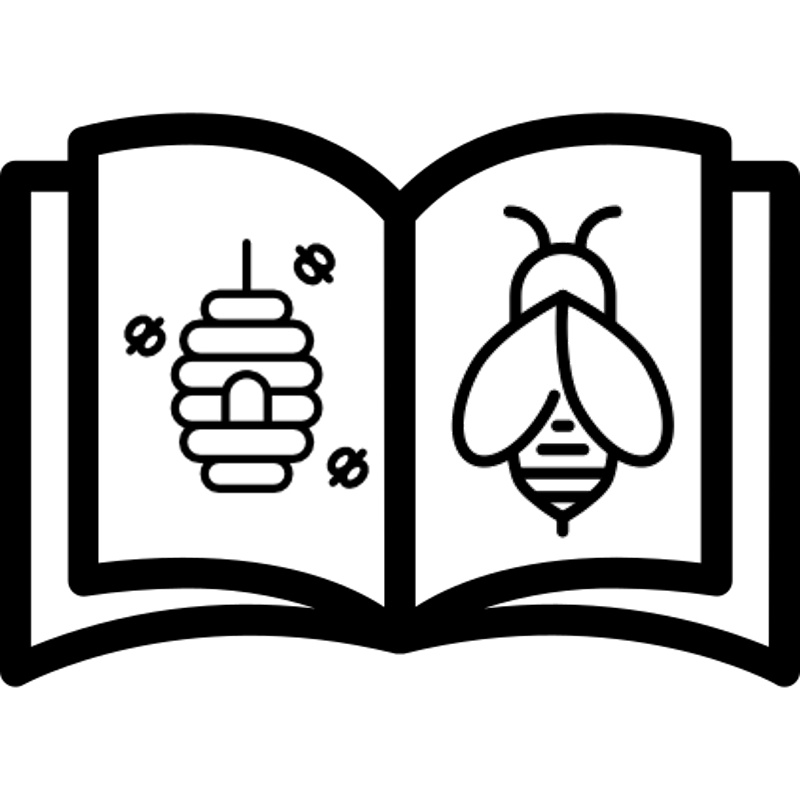{width=150px}](#general-information)</center>
<center>The Story</center>

### 
<center>[{width=150px}](#health-status)</center>
<center>Health Status</center>

### 
<center>[{width=150px}](#species)</center>
<center>The Honey Bee</center>


General Information {data-navmenu="Story"}
=====================================

Row {data-height=100}
-------------------------------------
### {.no-padding}
<h3>What is the current honey situation? - Information beehind</h3>

Row {data-height=500}
-------------------------------------
###
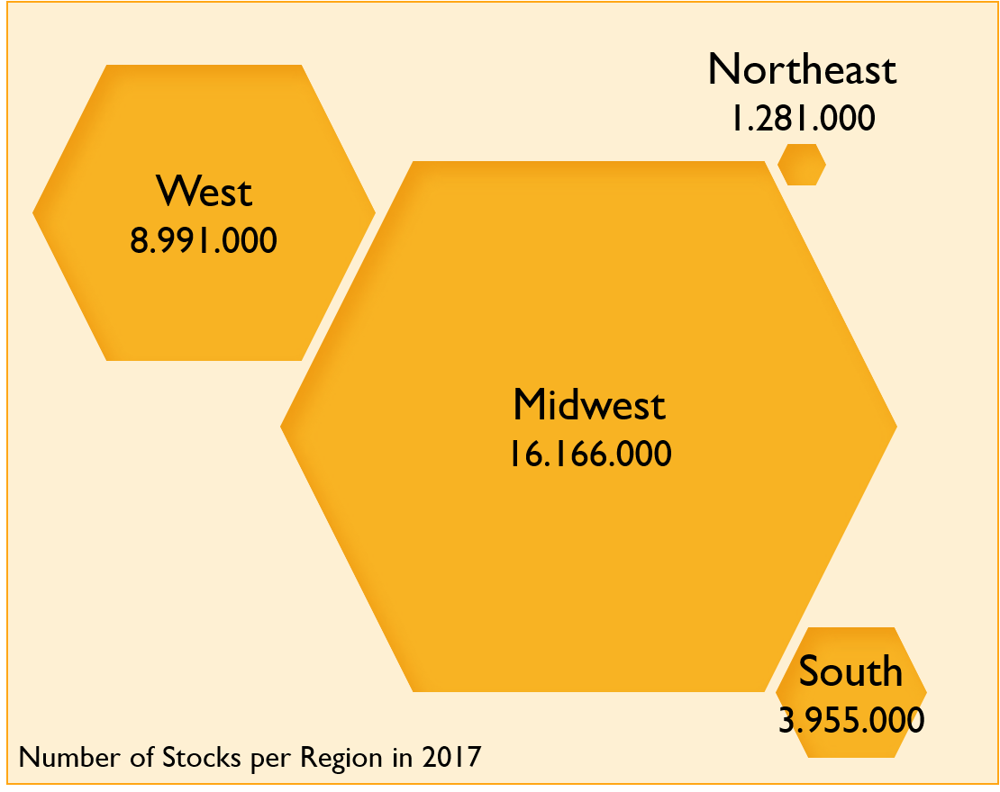

###
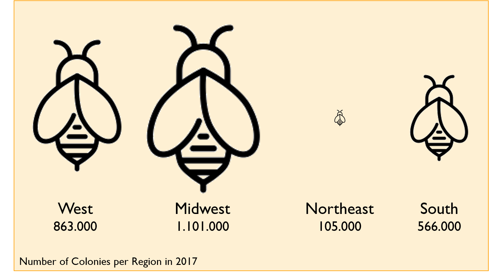

Row {data-height=500}
-------------------------------------
###
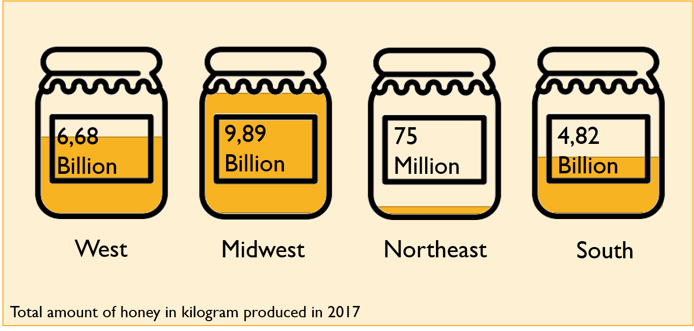

###
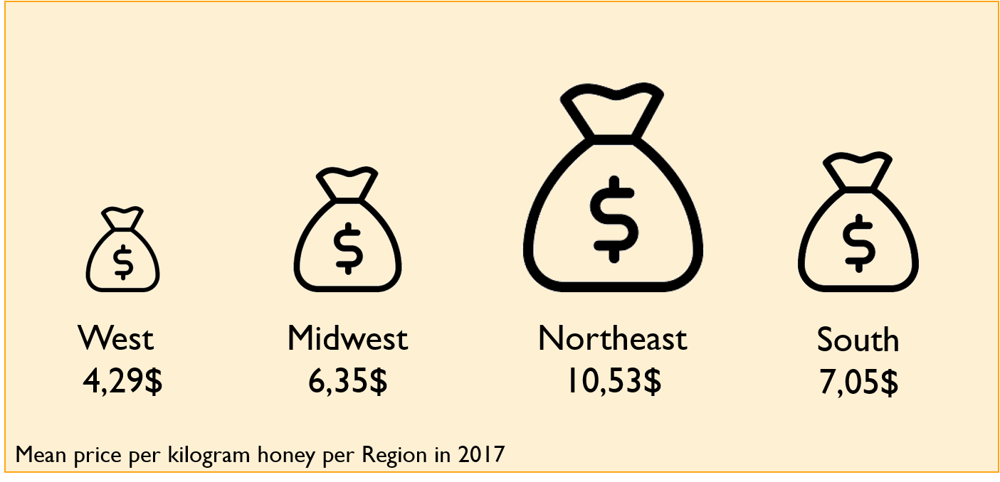

Row {data-height=100}
-------------------------------------
###

### {.no-padding}
<p style="text-align: right;">
  Where did all the honey go?&nbsp;&nbsp;&nbsp;[{width=50px}](#top-honey-states)
</p>


Top honey states  {data-navmenu="Story"}
=====================================

Row {data-height=100}
-------------------------------------
### {.no-padding}
<h3>Which states produce the most honey?</h3>

Row {data-height=1000}
-------------------------------------
###
```{r, eval = TRUE}
myCol <- c("#FE8C01", "#FCA235", "#FAAC25", "#e5b740", "#dd9a65", "#F5BF2A", "#FDC601", "#FEE86B", "#FCDC27", "#F8B847")

honeyperstate <- total_production %>%
    group_by(StateName) %>%
    summarise(sumprod=sum(totalprod_kg)) %>%
    arrange(sumprod) %>%
    mutate(percentage=round(sumprod/sum(sumprod)*100,2)) %>% 
    top_n(10)
    
ggplot(data=honeyperstate,
          aes(
              x=reorder(StateName,sumprod),
              y=sumprod/1000000
          )
       )+
       geom_col(aes(fill=StateName),show.legend=F)+
       geom_text(aes(label=percentage))+
       coord_flip()+
       labs(
         title="Top 10 honey producing states from 1991 to 2017", 
         subtitle = "Percentage of the total production (bars) and total amount (x-axis)",
         y="total honey produced [million kg]"
         )  +
       scale_fill_manual(values = myCol) +
       background_grid(major = "xy", minor="y", size.major = 0.2) +
       theme_minimal() 
```

###
As we have seen, a lot of honey was produced in the Midwest. And indeed, North Dakota (1992-2017) was the main producer of honey and produced 18.2 million kilos of honey. The top 10 states are North Dakota (Midwest), California (West), South Dakota (Midwest), Florida (South), Montana (West), Minnesota (Midwest), Texas (South), Wisconsin (Midwest), Michigan (Midwest) and Idaho (West) .

sumstate_total <- total_production %>%
  group_by(StateName, Region, add = TRUE) %>%
  summarise(numcol = sum(numcol),
            stocks = sum(stocks),
            #yieldpercol_kg = sum(yieldpercol_kg),
            #price_per_kg = sum(price_per_kg),
            totalprod_kg = sum(totalprod_kg)
            )
            
```{r}


kable(sumstate_total2) %>%
  kable_styling(bootstrap_options = "striped", full_width = F, position = "float_right")
```


Row {data-height=100}
-------------------------------------
### {.no-padding}
<p style="text-align: left;">
  [{width=50px}](#general-information)&nbsp;&nbsp;&nbsp;What is the current honey situation - information beehind
</p>

### {.no-padding}
<p style="text-align: right;">
  How does the honey spread across the country?&nbsp;&nbsp;&nbsp;[{width=50px}](#honey-production-map)
</p>


Honey Production Map {data-navmenu="Story"}
=====================================

Row {data-height=100}
-------------------------------------
### {.no-padding}
<h3>How does the honey spread across the country?</h3>

Row {data-height=800}
-------------------------------------
###


Row {data-height=200}
-------------------------------------
###
Lorem ipsum dolor sit amet, consetetur sadipscing elitr, sed diam nonumy eirmod tempor invidunt ut labore et dolore magna aliquyam erat, sed diam voluptua. At vero eos et accusam et justo duo dolores et ea rebum. Stet clita kasd gubergren, no sea takimata sanctus est Lorem ipsum dolor sit amet. Lorem ipsum dolor sit amet, consetetur sadipscing elitr, sed diam nonumy eirmod tempor invidunt ut labore et dolore magna aliquyam erat, sed diam voluptua. At vero eos et accusam et justo duo dolores et ea rebum. Stet clita kasd gubergren, no sea takimata sanctus est Lorem ipsum dolor sit amet.

Row {data-height=100}
-------------------------------------
### {.no-padding}
<p style="text-align: left;">
  [{width=50px}](#top-honey-states)&nbsp;&nbsp;&nbsp;Which states produce the most honey? 
</p>

### {.no-padding}
<p style="text-align: right;">
  How did the honey production change over the past decades?&nbsp;&nbsp;&nbsp;[{width=50px}](#honey-production-over-time)
</p>


Honey production over time {data-navmenu="Story"}
=====================================

Row {data-height=100}
-------------------------------------
### {.no-padding}
<h3>How did the honey production change over the past decades?</h3>

Row {data-height=800}
-------------------------------------
### {.no-padding}
```{r, eval = TRUE}

total_production %>% 
  select(Region, totalprod_kg, year) %>% 
  mutate(totalprod_kg_mio = totalprod_kg / 1000000) %>% 
  group_by(year, Region) %>% 
  summarise(totalprod_year_Region = mean(totalprod_kg_mio)) %>% 
  ggplot(aes(x = year, y = totalprod_year_Region, color = Region)) +
  geom_line() +
  scale_color_manual(values=c("#e5b740", "#595242", "#975422", "#dc842a")) +
  theme_minimal() +
  labs(
    title="Amount of honey produced after regions",
    x = "year",
    y = "honey produced [million kg]"
  ) -> p


ggplotly(p)
```

###
```{r}
scatter_ggplot = 
  sumregion_year %>%
  ggplot(aes(x = year, y = numcol, color = Region, fill= Region)) +
  geom_point() +
  geom_line() +
  labs(
    title="Number of honeyproducing colonies after regions",
    x="year", 
    y="number of colonies in total") +
  #scale_viridis() +
  scale_color_manual(values=c("#e5b740", "#595242", "#975422", "#dc842a")) +
  scale_fill_manual(values=c("#e5b740", "#595242", "#975422", "#dc842a")) +
  coord_cartesian() +
  theme_minimal()

ggplotly(scatter_ggplot)
```

###
```{r}
scatter_ggplot = 
  sumregion_year %>%
  ggplot(aes(x = year, y = numcol, color = Region, fill= Region)) +
  geom_point() +
  geom_line() +
  labs(
    title="Number of honeyproducing colonies after regions",
    x="year", 
    y="number of colonies in total") +
  #scale_viridis() +
  scale_color_manual(values=c("#e5b740", "#595242", "#975422", "#dc842a")) +
  scale_fill_manual(values=c("#e5b740", "#595242", "#975422", "#dc842a")) +
  coord_cartesian() +
  theme_minimal()

ggplotly(scatter_ggplot)
```

Row {data-height=200}
-------------------------------------
###
Lorem ipsum dolor sit amet, consetetur sadipscing elitr, sed diam nonumy eirmod tempor invidunt ut labore et dolore magna aliquyam erat, sed diam voluptua. At vero eos et accusam et justo duo dolores et ea rebum. Stet clita kasd gubergren, no sea takimata sanctus est Lorem ipsum dolor sit amet. Lorem ipsum dolor sit amet, consetetur sadipscing elitr, sed diam nonumy eirmod tempor invidunt ut labore et dolore magna aliquyam erat, sed diam voluptua. At vero eos et accusam et justo duo dolores et ea rebum. Stet clita kasd gubergren, no sea takimata sanctus est Lorem ipsum dolor sit amet.

```{r}

kable(sumstate_total) %>%
  kable_styling(bootstrap_options = "striped", full_width = F, position = "float_right")
```

Row {data-height=100}
-------------------------------------
### {.no-padding}
<p style="text-align: left;">
  [{width=50px}](#honey-production-map)&nbsp;&nbsp;&nbsp;How does the honey spread across the country? 
</p>

### {.no-padding}
<p style="text-align: right;">
  How did the honey price change over the past decades?&nbsp;&nbsp;&nbsp;[{width=50px}](#honey-price)
</p>


Honey Price {data-navmenu="Story"}
=====================================

Row {data-height=100}
-------------------------------------
### {.no-padding}
<h3>How did the honey price change over the past decades?</h3>

Row {data-height=800}
-------------------------------------
###
```{r}
scatter_ggplot = 
  meanregion_year %>%
  ggplot(aes(x = year, y = price_per_kg, color = Region, fill= Region)) +
  geom_point() +
  geom_line() +
  labs(
    title="Price per kilo of honey after regions",
    x="year", 
    y="price per kg of honey [$]") +
  #scale__viridis() +
  scale_color_manual(values=c("#e5b740", "#595242", "#975422", "#dc842a")) +
  scale_fill_manual(values=c("#e5b740", "#595242", "#975422", "#dc842a")) +
  coord_cartesian() +
  theme_minimal()

ggplotly(scatter_ggplot)
```


```{r, eval = FALSE}
scatter_ggplot = 
  total_production %>%
  ggplot(aes(x = year, y = numcol/100000, color = StateName, fill= StateName)) +
  geom_point() +
  geom_line() +
  labs(
    title="Number of honeyproducing colonies after regions",
    x="year", 
    y="number of colonies in 100k") +
  #scale_viridis() +
  #scale_color_manual(values=c("#e5b740", "#595242", "#975422", "#dc842a")) +
 # scale_fill_manual(values=c("#e5b740", "#595242", "#975422", "#dc842a")) +
  coord_cartesian() +
  theme_minimal()

ggplotly(scatter_ggplot)
```


Row {data-height=200}
-------------------------------------
###
Lorem ipsum dolor sit amet, consetetur sadipscing elitr, sed diam nonumy eirmod tempor invidunt ut labore et dolore magna aliquyam erat, sed diam voluptua. At vero eos et accusam et justo duo dolores et ea rebum. Stet clita kasd gubergren, no sea takimata sanctus est Lorem ipsum dolor sit amet. Lorem ipsum dolor sit amet, consetetur sadipscing elitr, sed diam nonumy eirmod tempor invidunt ut labore et dolore magna aliquyam erat, sed diam voluptua. At vero eos et accusam et justo duo dolores et ea rebum. Stet clita kasd gubergren, no sea takimata sanctus est Lorem ipsum dolor sit amet.


Row {data-height=100}
-------------------------------------
### {.no-padding}
<p style="text-align: left;">
  [{width=50px}](#honey-production-over-time)&nbsp;&nbsp;&nbsp;How did the honey production change over the past decades? 
</p>

### {.no-padding}
<p style="text-align: right;">
  How did the amount of colonies and their yield change over the years?&nbsp;&nbsp;&nbsp;[{width=50px}](#colony-productivity)
</p>


Colony Productivity {data-navmenu="Story"}
=====================================

Row {data-height=100}
-------------------------------------
### {.no-padding}
<h3>How did the amount of colonies and their yield change over the years?</h3>

Row {data-height=1000}
-------------------------------------
###
```{r, }
total_production %>%
  select(year, totalprod_kg, numcol, yieldpercol_kg) %>% 
  group_by(year) %>% 
  summarize_each(funs(mean)) %>% 
  mutate(totalprod_kg_mio = totalprod_kg / 1000000) %>% 
  ggplot(aes(x = year, y = totalprod_kg_mio)) +
  geom_point(
    aes(
      size = numcol, 
    color = yieldpercol_kg),
    shape = 19
  ) +
  geom_smooth(span = 2, se = FALSE, color = "gray", linetype = "dotted") +
  scale_color_viridis(direction = -1, option = "A", name = "Yield per Colony\n(kg)") +
  scale_x_continuous(limits = c(1992, 2017), breaks = c(1992, 1997, 2002, 2007, 2012, 2017)) +
  guides(size = guide_legend("Honey Producing\nColonies"), limits = c(55000, 65000)) +
  theme_minimal() +
  labs(title = "Total U.S. Honey Production Decreases", 
       x = "year", 
       y = "US Honey Production [million kg]") +
  NULL

#ggsave("honey.png", last_plot(), height = 4, width = 6, units = "in", dpi = 600)
```

###
Lorem ipsum dolor sit amet, consetetur sadipscing elitr, sed diam nonumy eirmod tempor invidunt ut labore et dolore magna aliquyam erat, sed diam voluptua. At vero eos et accusam et justo duo dolores et ea rebum. Stet clita kasd gubergren, no sea takimata sanctus est Lorem ipsum dolor sit amet. Lorem ipsum dolor sit amet, consetetur sadipscing elitr, sed diam nonumy eirmod tempor invidunt ut labore et dolore magna aliquyam erat, sed diam voluptua. At vero eos et accusam et justo duo dolores et ea rebum. Stet clita kasd gubergren, no sea takimata sanctus est Lorem ipsum dolor sit amet.

Row {data-height=100}
-------------------------------------
### {.no-padding}
<p style="text-align: left;">
  [{width=50px}](#honey-price)&nbsp;&nbsp;&nbsp;How did the honey price change over the past decades? 
</p>

### {.no-padding}
<p style="text-align: right;">
  Where did all the honey go?&nbsp;&nbsp;&nbsp;[{width=50px}](#honey-production-decline)
</p>


Honey Production Decline {data-navmenu="Story"}
=====================================

Row {data-height=100}
-------------------------------------
### {.no-padding}
<h3>Where did all the honey go?</h3>

Row {data-height=1000}
-------------------------------------
###
```{r echo=FALSE, eval = TRUE}
honeyyear <- total_production %>%
  group_by(year) %>%
  summarise(YearTotal=sum(totalprod))

ggplot(data=honeyyear, aes(x=year, y=YearTotal/1000000, title = "How much honey did the USA produce between 1991 and 2017?")) + 
  geom_smooth(method = "lm", color = "#975422") + 
  geom_line(color = "#f3a328", size = 2) +
  geom_point() +
  scale_x_continuous(breaks=seq(1991, 2017, 3)) +
  labs(x="years", y="total honey produced [million kg]") + 
  theme_minimal()+
  ggtitle("How much honey did the USA produce between 1991 and 2017?") +
  background_grid(major = "xy", minor="y", size.major = 0.2) 
```

###
In 1995, more than 210 million kilos of honey were produced by American bees. By 2015, the honey pots looked emptier, just under 150 million kilos of honey were the yield of recent years. Is there a reason?

Row {data-height=100}
-------------------------------------
### {.no-padding}
<p style="text-align: left;">
  [{width=50px}](#colony-productivity)&nbsp;&nbsp;&nbsp;How did the amount of colonies and their yield change of the years? 
</p>

### {.no-padding}
<p style="text-align: right;">
  A dramatic turn of... honey?&nbsp;&nbsp;&nbsp;[{width=50px}](#honey-and-neonic-pesticides)
</p>


Honey and Neonic Pesticides {data-navmenu="Story"}
=====================================

Row {data-height=100}
-------------------------------------
### {.no-padding}
<h3>A dramatic turn of... honey?</h3>

Row {data-height=1000}
-------------------------------------
###
```{r paged.print=TRUE, eval = TRUE}
pesticides_year_production <- pesticides %>%
  group_by(year) %>%
  summarise(production_year=sum(totalprod_kg))

pesticides_year_neonics <- pesticides %>% 
  na.omit(nAllNeonic) %>% 
  group_by(year) %>% 
  summarise(neonics_year=sum(nAllNeonic))

pesticides_year_total <- merge(pesticides_year_production, pesticides_year_neonics)

ggplot(data=pesticides_year_total,
                 aes(x = year)
                 ) + 
             geom_line(aes(y = production_year, colour = "Honey")) + 
             geom_line(aes(y = neonics_year*30, colour = "Neonic Pesticides")) + 
             scale_y_continuous(breaks=c(
                                          0, 10000000, 20000000, 30000000, 40000000, 50000000,
                                          60000000, 70000000, 80000000, 90000000, 100000000
                                        ),
                                labels=c( 
                                         "0", "10", "20", "30", "40", "50", "60", "70", "80", "90", "100"
                                         ),
                                sec.axis = sec_axis(~./30,
                                                    name = "Neonics applied in the US [million kg]",
                                                    breaks=c(0, 500000, 1000000, 1500000,
                                                             2000000, 2500000, 3000000, 3500000),
                                                    labels=c("0", "0,5", "1", "1,5", 
                                                             "2", "2,5", "3", "3,5")
                                                    )
                                ) +
  geom_point(aes(y = production_year, colour = "Honey")) + 
  geom_point(aes(y = neonics_year*30, colour = "Neonic Pesticides")) + 
  scale_colour_manual(values = c("#e5b740", "green")) + 
  labs(y = "Honey produced in the US [million kg]", x = "Year", colour = "Parameter") +
  ggtitle("Year 2000 - What happened to our honey?") +
  theme_minimal()
```


###
In a 2013, the European Food Safety Authority (EFSA) has been assigned by the European Union to conduct scientific research to the impact of neonicotinoids on honeybees. The studies findings stated that "neonicotinoids pose an unacceptably high risk to bees" and that previous research commissioned by insecticide manufacturers contained inexplicable data gaps. In response, the use of certain neonicotinoids has been restriced and tightend up over the years. 
In 2014, the US government under Barack Obama issued a blanket ban against the use of neonicotinoids on National Wildlife Refuges.
In 2018, the Trump administration reversed this decision.

The data shows a slight increase in use of neonic pesticides since 1994 and a strong rise starting in the early 2000s. At that time, besides imidacloprid, two other neonicotinoids, clothianidin and thiamethoxam, entered the market. After that point the amount of neonics applied rises drastically and only finally reaches a turning point in 2014, when neonicotinoids got restriced, and decreases by over 80%. 

Row {data-height=100}
-------------------------------------
### {.no-padding}
<p style="text-align: left;">
  [{width=50px}](#honey-production-decline)&nbsp;&nbsp;&nbsp;Where did all the honey go? 
</p>

### {.no-padding}
<p style="text-align: right;">
  Which neonics are used?&nbsp;&nbsp;&nbsp;[{width=50px}](#neonicotinoids)
</p>


Neonicotinoids {data-navmenu="Story"}
=====================================

Row {data-height=100}
-------------------------------------
### {.no-padding}
<h3>Which neonics are used?</h3>

Row {data-height=600}
-------------------------------------
###
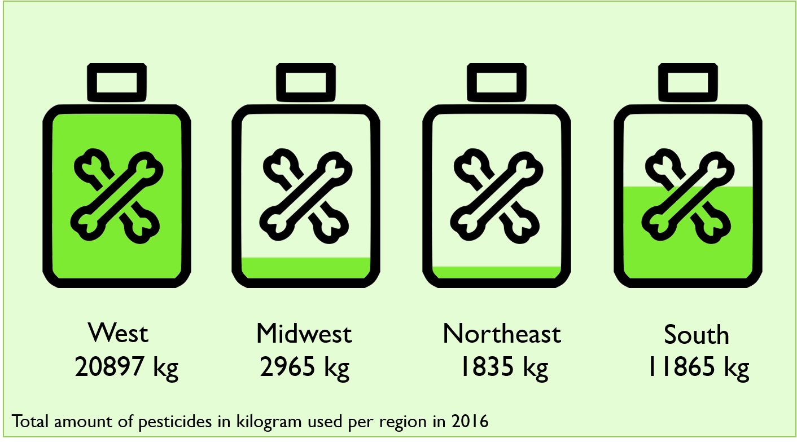

###
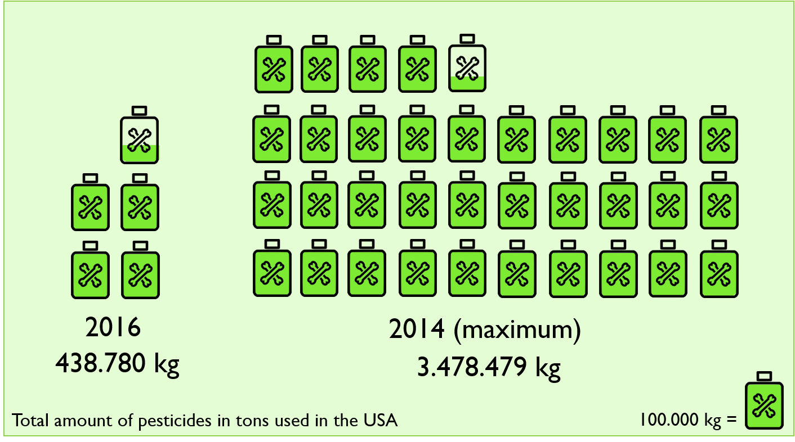

Row {data-height=400}
-------------------------------------
###
"Neonicotinoids (sometimes shortened to neonics /ˈniːoʊnɪks/) are a class of neuro-active insecticides chemically similar to nicotine.[...] <br>
Imidacloprid is the most widely used insecticide in the world.[...] <br>
Most academic and governmental bodies agree that neonicotinoids have had a negative influence on bee populations." [Source: 1]

Row {data-height=100}
-------------------------------------
### {.no-padding}
<p style="text-align: left;">
  [{width=50px}](#honey-and-neonic-pesticides)&nbsp;&nbsp;&nbsp;A dramatic turn of... honey? 
</p>

### {.no-padding}
<p style="text-align: right;">
  What did we learn?&nbsp;&nbsp;&nbsp;[{width=50px}](#summary)
</p>


Pesticide Use {data-navmenu="Story"}
=====================================

Row {data-height=100}
-------------------------------------
### {.no-padding}
<h3>Spreads like pest(icides)!</h3>

Row {data-height=1000}
-------------------------------------

```{r}
scatter_ggplot2 = 
  pesticideregion_total %>%
    group_by(year, Region) %>%
  na.omit(nAllNeonic_kg) %>%
  summarise(sumNeonic = sum(nAllNeonic_kg/1)) %>%
  ggplot(aes(x = year, y = sumNeonic, color = Region, fill= Region)) +
  geom_point() +
  geom_line() +
  labs(
    title="Used pesticides in after regions from 1994-2017",
    x="year", 
    y="amount of pesticides in kilogram") +
  #scale__viridis() +
  scale_color_manual(values=c("#006400", "#32CD32", "#A2CD5A", "#B3EE3A")) +
  scale_fill_manual(values=c("#006400", "#32CD32", "#A2CD5A", "#B3EE3A")) +
  coord_cartesian() +
  theme_minimal()

ggplotly(scatter_ggplot2)
```

###
Lorem ipsum dolor sit amet, consetetur sadipscing elitr, sed diam nonumy eirmod tempor invidunt ut labore et dolore magna aliquyam erat, sed diam voluptua. At vero eos et accusam et justo duo dolores et ea rebum. Stet clita kasd gubergren, no sea takimata sanctus est Lorem ipsum dolor sit amet. Lorem ipsum dolor sit amet, consetetur sadipscing elitr, sed diam nonumy eirmod tempor invidunt ut labore et dolore magna aliquyam erat, sed diam voluptua. At vero eos et accusam et justo duo dolores et ea rebum. Stet clita kasd gubergren, no sea takimata sanctus est Lorem ipsum dolor sit amet.

Row {data-height=100}
-------------------------------------
### {.no-padding}
<p style="text-align: left;">
  [{width=50px}](#neonicotinoids)&nbsp;&nbsp;&nbsp;Which neonics are used? 
</p>

### {.no-padding}
<p style="text-align: right;">
  What did we learn?&nbsp;&nbsp;&nbsp;[{width=50px}](#summary)
</p>


Summary {data-navmenu="Story"}
=====================================

Row {data-height=100}
-------------------------------------
### {.no-padding}
<h3>What did we learn?</h3>

Row {data-height=900}
-------------------------------------
###
<strong>What did we learn?</strong>

<ul>
  <li>Most honey is produced in the midwest</li>
  <li>The northeast has the highest honey price while producing the least</li>
  <li>With 18.2 M kg since 1992, North Dakota is the #1 honey producer in the US</li>
</ul>

<br>
<hr>
<strong>Our Advice</strong>

Lorem ipsum dolor sit amet, consetetur sadipscing elitr, sed diam nonumy eirmod tempor invidunt ut labore et dolore magna aliquyam erat, sed diam voluptua. At vero eos et accusam et justo duo dolores et ea rebum. Stet clita kasd gubergren, no sea takimata sanctus est Lorem ipsum dolor sit amet. Lorem ipsum dolor sit amet, consetetur sadipscing elitr, sed diam nonumy eirmod tempor invidunt ut labore et dolore magna aliquyam erat, sed diam voluptua. At vero eos et accusam et justo duo dolores et ea rebum. Stet clita kasd gubergren, no sea takimata sanctus est Lorem ipsum dolor sit amet.


Row {data-height=100}
-------------------------------------
### {.no-padding}
<p style="text-align: left;">
  [{width=50px}](#honey-and-neonic-pesticides)&nbsp;&nbsp;&nbsp;A dramatic turn of... honey? 
</p>

### {.no-padding}


Species  {data-navmenu="The Honey Bee"}
=====================================

Row {data-height=100}
-------------------------------------
### {.no-padding}
<h2>Species</h2>

Row {data-height=600}
-------------------------------------
###
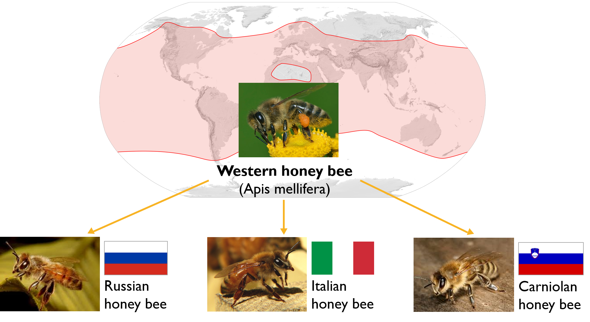

Row {data-height=150}
-------------------------------------
###
<strong>Western bee (Apis mellifera)</strong> <br>
Most common of the 7-12 species. Like all honey bee species, the western honey bee is eusocial, creating colonies with a single fertile female (or "queen"), many normally non-reproductive females or "workers", and a small proportion of fertile males or "drones". Individual colonies can house tens of thousands of bees. Colony activities are organized by complex communication between individuals, through both pheromones and the dance language. Western honey bees are threatened by pests and diseases, especially the Varroa mite and colony collapse disorder. [Source: 2]

Row {data-height=350}
-------------------------------------
###
<strong>Russian Honey Bee</strong><br>
The Russian honeybee refers to honey bees (Apis mellifera) that originate in the Primorsky Krai region of Russia. This strain of bee was imported into the United States in 1997 by the USDA's Honeybee Breeding, Genetics & Physiology Laboratory in Baton Rouge, Louisiana in response to severe declines in bee populations caused by infestations of parasitic mites, and has been used in breeding programs to improve existing stocks. Russian honey bees have an innate resistance to various parasitic mites. This strain occurs in the original native range of the varroa mite, and selective pressure could have favored bees that exhibited aggressive behavior against colony-level mite infestations. Accordingly, experimental research has found that mite populations decline in colonies of pure Russian[2] and of hybrid Russian-Italian bees. The mechanisms through which mite populations are controlled in these colonies include hygienic behavior towards mites,[4] and possibly increased aggression towards mites. Russian stocks also have been shown to resist infection by tracheal mites. 
[Source: 3]

###
<strong>Italian honey bee</strong><br> 
Apis mellifera ligustica is the Italian bee which is a subspecies of the western honey bee (Apis mellifera). The Italian honey bee is thought to originate from the continental part of Italy, south of the Alps, and north of Sicily. The subspecies may have survived the last Ice Age in Italy.[1] It is genetically a different subspecies than that from the Iberian peninsula and from Sicily. It is the most widely distributed of all honey bees, and has proven adaptable to most climates from subtropical to cool temperate, but it is less successful in humid tropical regions. It is sometimes called the Ligurian bee.Italian bees, having been conditioned to the warmer climate of the central Mediterranean, are less able to cope with the "hard" winters and cool, wet springs of more northern latitudes. They do not form such tight winter clusters. More food has to be consumed to compensate for the greater heat loss from the loose cluster. The tendency to raise broods late in autumn also increases food consumption.
[Source: 4]

###
<strong>Carniolan honey bee</strong> </br>
The Carniolan honey bee (Apis mellifera carnica, Pollmann) is a subspecies of the western honey bee. The Carniolan honey bee is native to Slovenia, southern Austria, and parts of Croatia, Bosnia and Herzegovina, Serbia, Hungary, Romania, and Bulgaria. It is favored among beekeepers for several reasons, not the least being its ability to defend itself successfully against insect pests while at the same time being extremely gentle in its behavior toward beekeepers. These bees are particularly adept at adjusting worker population to nectar availability. It relies on these rapid adjustments of population levels to rapidly expand worker bee populations after nectar becomes available in the spring, and, again, to rapidly cut off brood production when nectar ceases to be available in quantity. Carniolan honey bees are about the same size as the Italian honey bee, but they are physically distinguished by their generally dusky brown-grey color that is relieved by stripes of a subdued lighter brown color. Their chitin is dark, but it is possible to find lighter colored or brown colored rings and dots on their bodies. They are also known as the "grey bee". 
[Source: 5]

Locations  {data-navmenu="The Honey Bee"}
=====================================

Row {data-height=100}
-------------------------------------
### {.no-padding}
<h2>Locations</h2>

Row {data-height=800}
-------------------------------------
###
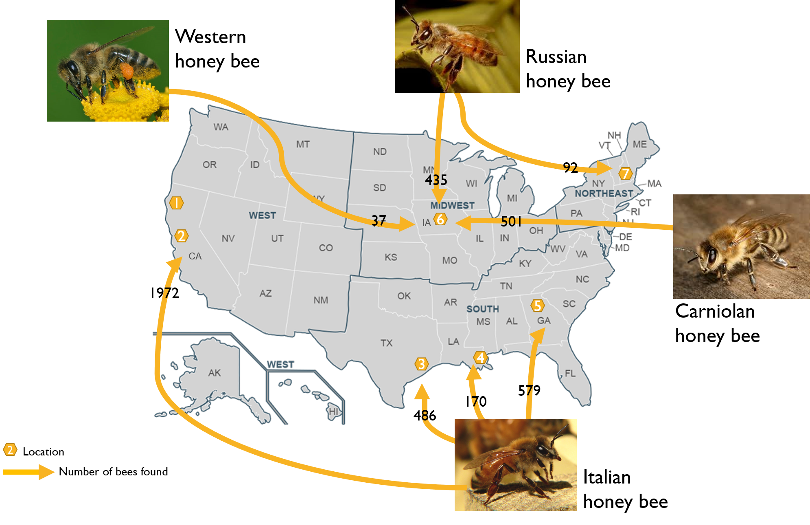

Row {data-height=200}
-------------------------------------
###
1= San Jose, California <br>
2= Saratoga, California <br>
3= Alvin, Texas <br>
4= New Orleans, Lousiana <br>
5= Athens, Georgia <br>
6= Des Moines, Indiana <br>
7= Keene, New Hampshire <br>


Health Status {data-navmenu="The Honey Bee"}
=====================================

Row {data-height=100}
-------------------------------------
### {.no-padding}
<h2>Unnatural Beehiviour: Ssssssomething wrong with the bees?</h2>

Row {data-height=700}
-------------------------------------
###
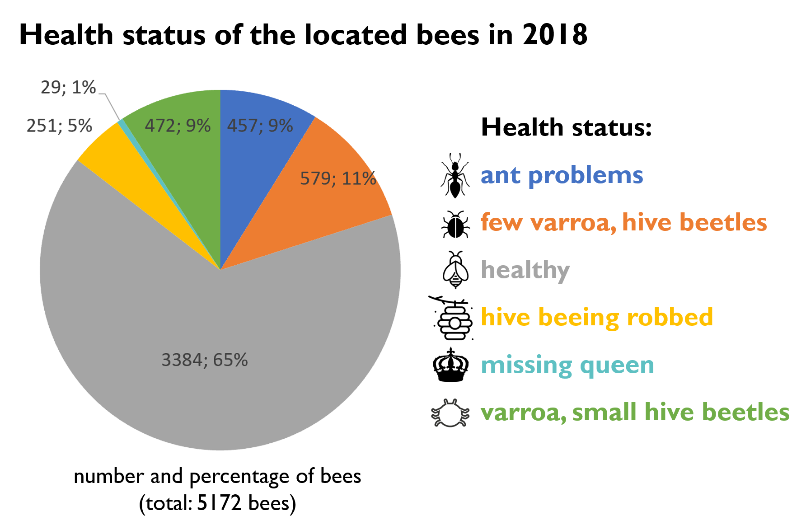

###
Lorem ipsum dolor sit amet, consetetur sadipscing elitr, sed diam nonumy eirmod tempor invidunt ut labore et dolore magna aliquyam erat, sed diam voluptua. At vero eos et accusam et justo duo dolores et ea rebum. Stet clita kasd gubergren, no sea takimata sanctus est Lorem ipsum dolor sit amet. Lorem ipsum dolor sit amet, consetetur sadipscing elitr, sed diam nonumy eirmod tempor invidunt ut labore et dolore magna aliquyam erat, sed diam voluptua. At vero eos et accusam et justo duo dolores et ea rebum. Stet clita kasd gubergren, no sea takimata sanctus est Lorem ipsum dolor sit amet.

Row {data-height=300}
-------------------------------------
###
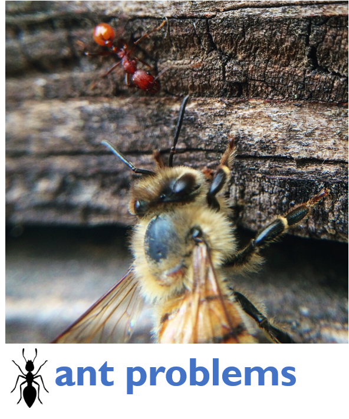

###
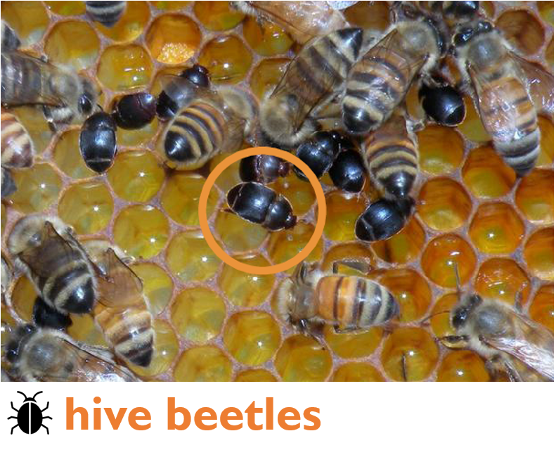

###
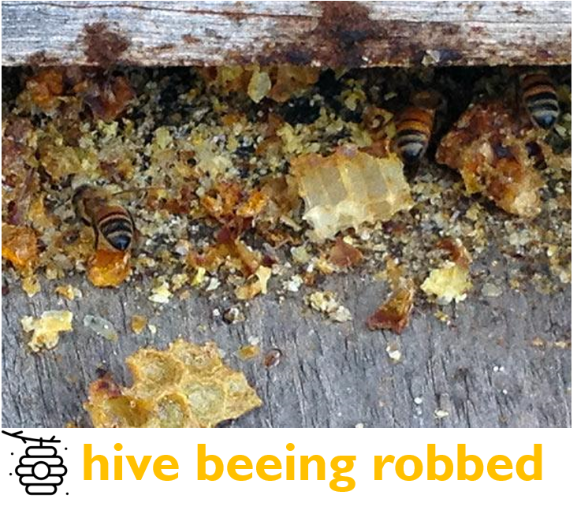

###
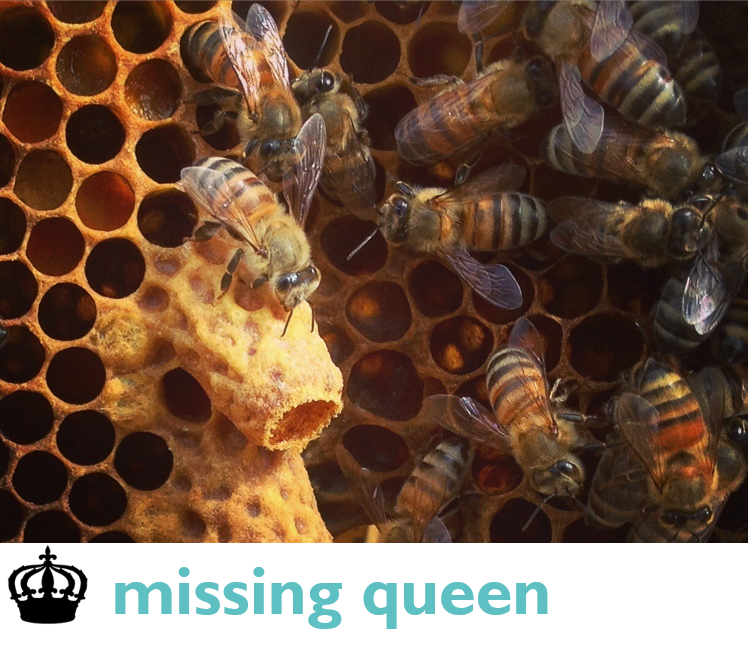

###
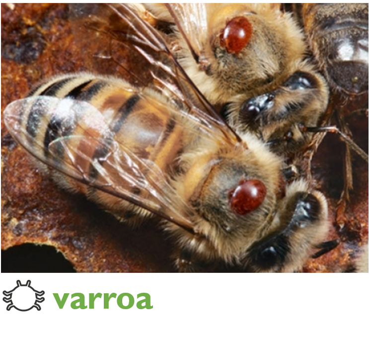

###


About {}
=====================================
Row {data-height=700}
-------------------------------------
###
<h3>About BEE AWARE – Philosophy</h3>
Without bees, our crops would be a lot lower, not only for fruits and vegetables but also for plants like cotton. Bees play a key role in the supply chain of humans and animals. In terms of biodiversity, the diversity of species, bees, especially wild bees, play a central role. They are an integral part of a functioning ecosystem, from which life, as we know it, depends in many ways. Without pollen and nectar collecting bees we miss important flower pollinators.
The use of pesticides, monocultures and other harmful environmental effects not only threatens the honey bee, more than half of all wild bees are endangered. The danger is recognized and there are already several smaller and larger companies to protect the bees. What is missing, however, is a pooling of forces, a strong, long-range campaign and a central communications platform to channel public attention to the protection of wild bees. For this purpose, "beeaware" makes strong and provides an explanation about the situation of bees in the US. This results in the initiative "beeaware".
<br><br>
<strong>What is BEE AWARE doing?</strong>
<br>
"Beeaware" supports local and regional beekeepers in their education through a broad reach. In addition, it is represented on numerous honey products from retail, so interested citizens quickly and easily get up to date information and research results around the bee world. In addition, beeaware supports the distribution of flower seeds to protect and preserve the habitat of wild and honey bees.
How do I recognize beeaware?
You always recognize products supported by beeaware on our logo (see below). From there, a QR code always leads to our website!

<hr>

<h3>Credits</h3>
<br>
<strong>Datasets</strong> <br>
https://www.kaggle.com/jessicali9530/honey-production <br>
https://www.kaggle.com/kevinzmith/honey-with-neonic-pesticide <br>
https://www.kaggle.com/jenny18/honey-bee-annotated-images <br>

<strong>Web Articles</strong> <br>
https://www.greenpeace.de/sites/www.greenpeace.de/files/neonicotinoid_pesticides_final_single_web_final.pdf <br>
[1]https://en.wikipedia.org/wiki/Neonicotinoid <br>
[2]https://en.wikipedia.org/wiki/Western_honey_bee <br>
[3]https://en.wikipedia.org/wiki/Russian_honey_bee <br>
[4]https://en.wikipedia.org/wiki/Italian_bee <br>
[5]https://en.wikipedia.org/wiki/Carniolan_honey_bee <br>

<strong>Images</strong> <br>
Global distribution map: https://en.wikipedia.org/wiki/Western_honey_bee#/media/File:Apis_mellifera_distribution_map.svg <br>

Tabelle Staaten, Region
Maßstab PPT Grafiken

Row {data-height=300}
-------------------------------------
###
<h3>Bee Aware Campaign</h3> <br>
Informationsvisualisierung <br>
RWTH Aachen <br><br>
<strong>Founders</strong> <br>
Anne Vollema <br>
Tom Gerlach <br>


###
An initiative of Bee Aware
<center></center>

###
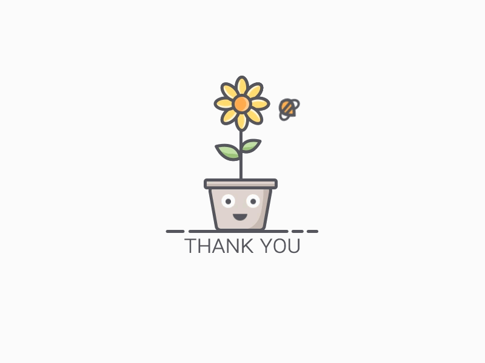


