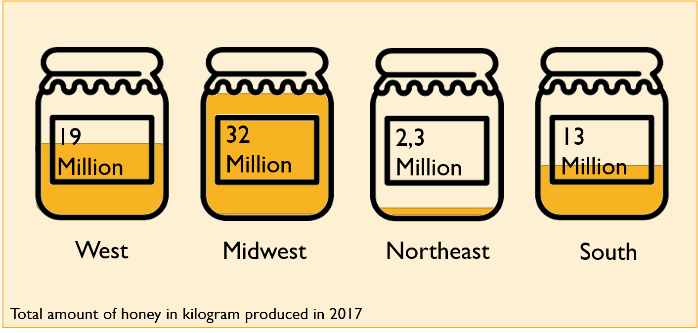

```{r setup, include=FALSE}
library(flexdashboard)
library(tidyverse, quietly = TRUE, warn.conflicts = FALSE) #because...duh
library(readxl)
library(viridis) #awesome color-blind friendly palette
library(janitor) #clean data
library(ggplot2)
library(knitr)
library(cowplot)
library(RColorBrewer)
library(measurements)
library(dygraphs)
library(flexdashboard)
library(plotly)
library(shiny)
library(psych)
library(DT)
library(rworldmap)
library(kableExtra)
library(gapminder)

#colorbrewer palette YlOrBr
```

```{r}
#honeyporduction dataframe
honeyproduction <- read.csv(file="honeyproduction.csv", header=TRUE, sep=",")

#Umrechnen von Pfund in Kilogramm
honeyproduction <- honeyproduction %>% 
  mutate(yieldpercol_kg = conv_unit(yieldpercol, "lbs", "kg"),
         price_per_kg = priceperlb / conv_unit(1, "lbs", "kg"),
         totalprod_kg = conv_unit(totalprod, "lbs", "kg")
         )
#nomissing values 
#colSums(is.na(honeyproduction))
```


```{r, eval = TRUE}
#pesticides dataframe
pesticides <- read.csv(file="vHoneyNeonic_v03.csv", header=TRUE, sep=",")

#Umrechnen von Pfund in Kilogramm
pesticides <- pesticides %>% 
  mutate(yieldpercol_kg = conv_unit(yieldpercol, "lbs", "kg"),
         price_per_kg = priceperlb / conv_unit(1, "lbs", "kg"),
         totalprod_kg = conv_unit(totalprod, "lbs", "kg"),
         nAllNeonic_kg = conv_unit(nAllNeonic, "lbs", "kg")
         )
```


```{r, eval = TRUE}
# total_production <- merge(honeyproduction, pesticides, by=c("state", "numcol", "stocks", "price_per_kg", "prodvalue", "year", "yieldpercol_kg", "price_per_kg", "total_prod"))


total_production <- bind_rows(honeyproduction, pesticides) 

#remove duplicates by deleting missing N.A. row (region)
total_production <- total_production[!is.na(total_production$Region), ]
write.csv(total_production,"C:\\Users\\Anne\\Documents\\infovis_wallstreet73\\total_production.csv", row.names = TRUE)


```

```{r}
#region
sumregion_year <- total_production %>%
  group_by(Region, year, add = TRUE) %>%
  summarise(numcol = sum(numcol),
            stocks = sum(stocks),
            yieldpercol_kg = sum(yieldpercol_kg),
            #price_per_kg = sum(price_per_kg),
            #nAllNeonic_kg = sum(nAllNeonic_kg),
            totalprod_kg = sum(totalprod_kg)
            )


sumregion_total <- total_production %>%
  group_by(Region, add = TRUE) %>%
  summarise(numcol = sum(numcol),
            stocks = sum(stocks),
            yieldpercol_kg = sum(yieldpercol_kg),
            #price_per_kg = sum(price_per_kg),
            #nAllNeonic_kg = sum(nAllNeonic_kg),
            totalprod_kg = sum(totalprod_kg)
            )

meanregion_year <- total_production %>%
  group_by(Region, year, add = TRUE) %>%
  summarise(numcol = mean(numcol),
            stocks = mean(stocks),
            yieldpercol_kg = mean(yieldpercol_kg),
            price_per_kg = mean(price_per_kg),
            #nAllNeonic_kg = mean(nAllNeonic_kg),
            totalprod_kg = mean(totalprod_kg)
            )

meanregion_total <- total_production %>%
  group_by(Region, add = TRUE) %>%
  summarise(numcol = mean(numcol),
            stocks = mean(stocks),
            yieldpercol_kg = mean(yieldpercol_kg),
            price_per_kg = mean(price_per_kg),
            #nAllNeonic_kg = mean(nAllNeonic_kg),
            totalprod_kg = mean(totalprod_kg)
            )

pesticideregion_total <- total_production %>%
  group_by(Region, year, add = TRUE) %>%
  summarise(nAllNeonic_kg = mean(nAllNeonic_kg, na.rm = TRUE),
            nAllNeonic_kg = sum(nAllNeonic_kg)
            )

pesticide_total <- total_production %>% 
  group_by(Region, #year,
                         add = TRUE) %>%
  summarise(AllNeonic_kg = sum(nAllNeonic_kg, na.rm = TRUE)
            )

sumstate_total <- total_production %>%
  group_by(StateName, add = TRUE) %>%
  summarise(numcol = sum(numcol),
            stocks = sum(stocks),
            yieldpercol_kg = sum(yieldpercol_kg),
            price_per_kg = sum(price_per_kg),
            totalprod_kg = sum(totalprod_kg)
            )

data2017 <-  sumregion_year[  sumregion_year$year=="2017" , ]

```


```{r data_beeimages, eval = TRUE}
# beeimages
bee_data <- read.csv(file="bee_data.csv", header=TRUE, sep=",")
```

Start {data-icon="fa-home"}
=====================================  

Row {data-height=500}
-------------------------------------
###
<center><h3>Welcome to BEE AWARE!</h3></center>
Lorem ipsum dolor sit amet, consetetur sadipscing elitr, sed diam nonumy eirmod tempor invidunt ut labore et dolore magna aliquyam erat, sed diam voluptua. At vero eos et accusam et justo duo dolores et ea rebum. Stet clita kasd gubergren, no sea takimata sanctus est Lorem ipsum dolor sit amet. Lorem ipsum dolor sit amet, consetetur sadipscing elitr, sed diam nonumy eirmod tempor invidunt ut labore et dolore magna aliquyam erat, sed diam voluptua. At vero eos et accusam et justo duo dolores et ea rebum. Stet clita kasd gubergren, no sea takimata sanctus est Lorem ipsum dolor sit amet.

### 
 

Row {data-height=200}
-------------------------------------
###
<h1 style="text-align: center; color: rgba(147, 197, 75, 1); letter-spacing: 5px; word-spacing: 10px; text-shadow: 2px 2px lightgrey;">
  Fly around and discover the Story of the Bees!
</h1>

Row {data-height=300}
-------------------------------------
###
<center>[{width=150px}](#general-information)</center>
<center>The Story</center>

### 
<center>[{width=150px}](#health-status)</center>
<center>Health Status</center>

### 
<center>[{width=150px}](#the-honey-bee)</center>
<center>The Honey Bee</center>


General Information {data-navmenu="Story"}
=====================================

Row {data-height=100}
-------------------------------------
### {.no-padding}
<h3>What is the current honey situation? - Information beehind</h3>

Row {data-height=500}
-------------------------------------
###


###


Row {data-height=500}
-------------------------------------
###


###


Row {data-height=100}
-------------------------------------
###

### {.no-padding}
<p style="text-align: right;">
  Where did all the honey go?&nbsp;&nbsp;&nbsp;[{width=50px}](#top-honey-states)
</p>


Top honey states  {data-navmenu="Story"}
=====================================

Row {data-height=100}
-------------------------------------
### {.no-padding}
<h3>Which states produce the most honey?</h3>

Row {data-height=1000}
-------------------------------------
###
```{r, eval = TRUE}
myCol <- c("#FE8C01", "#FCA235", "#FAAC25", "#e5b740", "#dd9a65", "#F8B847", "#F5BF2A", "#FDC601", "#FCDC27", "#FEE86B")

honeyperstate <- honeyproduction %>%
    group_by(state) %>%
    summarise(sumprod=sum(totalprod)) %>%
    arrange(sumprod) %>%
    mutate(percentage=round(sumprod/sum(sumprod)*100,2)) %>% 
    top_n(10)
    
ggplot(data=honeyperstate,
          aes(
              x=reorder(state,sumprod),
              y=sumprod/1000000
          )
       )+
       geom_col(aes(fill=state),show.legend=F)+
       geom_text(aes(label=percentage))+
       coord_flip()+
       labs(x="states of the USA",y="total honey produced (in million kg)",title="In which state were the honeybees most diligent?")  +
       scale_fill_brewer("myCol") +
       background_grid(major = "xy", minor="y", size.major = 0.2) +
       theme_grey() 
```

###
As we have seen, a lot of honey was produced in the Midwest. And indeed, North Dakota (1992-2017) was the main producer of honey and produced 18.2 million kilos of honey. The top 10 states are North Dakota (Midwest), California (West), South Dakota (Midwest), Florida (South), Montana (West), Minnesota (Midwest), Texas (South), Wisconsin (Midwest), Michigan (Midwest) and Idaho (West) .

Row {data-height=100}
-------------------------------------
### {.no-padding}
<p style="text-align: left;">
  [{width=50px}](#general-information)&nbsp;&nbsp;&nbsp;What is the current honey situation - information beehind
</p>

### {.no-padding}
<p style="text-align: right;">
  How does the honey spread across the country?&nbsp;&nbsp;&nbsp;[{width=50px}](#honey-production-map)
</p>


Honey Production Map {data-navmenu="Story"}
=====================================

Row {data-height=100}
-------------------------------------
### {.no-padding}
<h3>How does the honey spread across the country?</h3>

Row {data-height=800}
-------------------------------------
###


Row {data-height=200}
-------------------------------------
###
Lorem ipsum dolor sit amet, consetetur sadipscing elitr, sed diam nonumy eirmod tempor invidunt ut labore et dolore magna aliquyam erat, sed diam voluptua. At vero eos et accusam et justo duo dolores et ea rebum. Stet clita kasd gubergren, no sea takimata sanctus est Lorem ipsum dolor sit amet. Lorem ipsum dolor sit amet, consetetur sadipscing elitr, sed diam nonumy eirmod tempor invidunt ut labore et dolore magna aliquyam erat, sed diam voluptua. At vero eos et accusam et justo duo dolores et ea rebum. Stet clita kasd gubergren, no sea takimata sanctus est Lorem ipsum dolor sit amet.

Row {data-height=100}
-------------------------------------
### {.no-padding}
<p style="text-align: left;">
  [{width=50px}](#top-honey-states)&nbsp;&nbsp;&nbsp;Which states produce the most honey? 
</p>

### {.no-padding}
<p style="text-align: right;">
  How did the honey production change over the past decades?&nbsp;&nbsp;&nbsp;[{width=50px}](#honey-production-over-time)
</p>


Honey production over time {data-navmenu="Story"}
=====================================

Row {data-height=100}
-------------------------------------
### {.no-padding}
<h3>How did the honey production change over the past decades?</h3>

Row {data-height=1000}
-------------------------------------
### {.no-padding}
```{r, eval = TRUE}

total_production %>% 
  select(Region, totalprod_kg, year) %>% 
  mutate(totalprod_kg_mio = totalprod_kg / 1000000) %>% 
  group_by(year, Region) %>% 
  summarise(totalprod_year_Region = mean(totalprod_kg_mio)) %>% 
  ggplot(aes(x = year, y = totalprod_year_Region, color = Region)) +
  geom_line() +
  theme_minimal() +
  labs(
    title = "default",
    x = "Blbbaskd",
    y = "blabla"
  ) -> p


ggplotly(p)

```

Row {data-height=100}
-------------------------------------
### {.no-padding}
<p style="text-align: left;">
  [{width=50px}](#honey-production-map)&nbsp;&nbsp;&nbsp;How does the honey spread across the country? 
</p>

### {.no-padding}
<p style="text-align: right;">
  How did the honey price change over the past decades?&nbsp;&nbsp;&nbsp;[{width=50px}](#honey-price)
</p>


Honey Price {data-navmenu="Story"}
=====================================

Row {data-height=100}
-------------------------------------
### {.no-padding}
<h3>How did the honey price change over the past decades?</h3>

Row {data-height=1000}
-------------------------------------
###
```{r}
scatter_ggplot = 
  meanregion_year %>%
  ggplot(aes(x = year, y = price_per_kg, color = Region, fill= Region)) +
  geom_point() +
  geom_line() +
  #scale__viridis() +
  coord_cartesian() +
  theme_classic()

ggplotly(scatter_ggplot)
```

Row {data-height=100}
-------------------------------------
### {.no-padding}
<p style="text-align: left;">
  [{width=50px}](#honey-production-over-time)&nbsp;&nbsp;&nbsp;How did the honey production change over the past decades? 
</p>

### {.no-padding}
<p style="text-align: right;">
  How did the amount of colonies and their yield change over the years?&nbsp;&nbsp;&nbsp;[{width=50px}](#colony-productivity)
</p>


Colony Productivity {data-navmenu="Story"}
=====================================

Row {data-height=100}
-------------------------------------
### {.no-padding}
<h3>How did the amount of colonies and their yield change over the years?</h3>

Row {data-height=1000}
-------------------------------------
###
```{r, }
total_production %>%
  select(year, totalprod_kg, numcol, yieldpercol_kg) %>% 
  group_by(year) %>% 
  summarize_each(funs(mean)) %>% 
  mutate(totalprod_kg_mio = totalprod_kg / 1000000) %>% 
  ggplot(aes(x = year, y = totalprod_kg_mio)) +
  geom_point(
    aes(
      size = numcol, 
    color = yieldpercol_kg),
    shape = 19
  ) +
  geom_smooth(span = 2, se = FALSE, color = "gray", linetype = "dotted") +
  scale_color_viridis(direction = -1, option = "A", name = "Yield per Colony\n(kg)") +
  scale_x_continuous(limits = c(1992, 2017), breaks = c(1992, 1997, 2002, 2007, 2012, 2017)) +
  guides(size = guide_legend("Honey Producing\nColonies"), limits = c(55000, 65000)) +
  theme_minimal() +
  labs(title = "Total U.S. Honey Production Decreases", 
       x = "Year", 
       y = "US Honey Production (millions of kg)") +
  NULL

#ggsave("honey.png", last_plot(), height = 4, width = 6, units = "in", dpi = 600)
```

###
Lorem ipsum dolor sit amet, consetetur sadipscing elitr, sed diam nonumy eirmod tempor invidunt ut labore et dolore magna aliquyam erat, sed diam voluptua. At vero eos et accusam et justo duo dolores et ea rebum. Stet clita kasd gubergren, no sea takimata sanctus est Lorem ipsum dolor sit amet. Lorem ipsum dolor sit amet, consetetur sadipscing elitr, sed diam nonumy eirmod tempor invidunt ut labore et dolore magna aliquyam erat, sed diam voluptua. At vero eos et accusam et justo duo dolores et ea rebum. Stet clita kasd gubergren, no sea takimata sanctus est Lorem ipsum dolor sit amet.

Row {data-height=100}
-------------------------------------
### {.no-padding}
<p style="text-align: left;">
  [{width=50px}](#honey-price)&nbsp;&nbsp;&nbsp;How did the honey price change over the past decades? 
</p>

### {.no-padding}
<p style="text-align: right;">
  Where did all the honey go?&nbsp;&nbsp;&nbsp;[{width=50px}](#honey-production-decline)
</p>


Honey Production Decline {data-navmenu="Story"}
=====================================

Row {data-height=100}
-------------------------------------
### {.no-padding}
<h3>Where did all the honey go?</h3>

Row {data-height=1000}
-------------------------------------
###
```{r echo=FALSE, eval = TRUE}
honeyyear <- total_production %>%
  group_by(year) %>%
  summarise(YearTotal=sum(totalprod))

ggplot(data=honeyyear, aes(x=year, y=YearTotal/1000000, title = "How much honey did the USA produce between xx and xx?")) + 
  geom_smooth(method = "lm") + 
  geom_line(color = "#f3a328", size = 2) +
  geom_point() +
  scale_x_continuous(breaks=seq(1991, 2017, 3)) +
  ylab("Million kg Honey produced") + 
  xlab("years") +
  theme_bw()+
  ggtitle("How much honey did the USA produce between xx and xx?") +
  background_grid(major = "xy", minor="y", size.major = 0.2) 
```

###
In 1995, more than 210 million kilos of honey were produced by American bees. By 2015, the honey pots looked emptier, just under 150 million kilos of honey were the yield of recent years. Is there a reason?

Row {data-height=100}
-------------------------------------
### {.no-padding}
<p style="text-align: left;">
  [{width=50px}](#colony-productivity)&nbsp;&nbsp;&nbsp;How did the amount of colonies and their yield change of the years? 
</p>

### {.no-padding}
<p style="text-align: right;">
  A dramatic turn of... honey?&nbsp;&nbsp;&nbsp;[{width=50px}](#honey-and-neonic-pesticides)
</p>


Honey and Neonic Pesticides {data-navmenu="Story"}
=====================================

Row {data-height=100}
-------------------------------------
### {.no-padding}
<h3>A dramatic turn of... honey?</h3>

Row {data-height=1000}
-------------------------------------
###
```{r paged.print=TRUE, eval = TRUE}
pesticides_year_production <- pesticides %>%
  group_by(year) %>%
  summarise(production_year=sum(totalprod_kg))

pesticides_year_neonics <- pesticides %>% 
  na.omit(nAllNeonic) %>% 
  group_by(year) %>% 
  summarise(neonics_year=sum(nAllNeonic))

pesticides_year_total <- merge(pesticides_year_production, pesticides_year_neonics)

ggplot(data=pesticides_year_total,
                 aes(x = year)
                 ) + 
             geom_line(aes(y = production_year, colour = "Honey")) + 
             geom_line(aes(y = neonics_year*30, colour = "Neonic Pesticides")) + 
             scale_y_continuous(breaks=c(
                                          0, 10000000, 20000000, 30000000, 40000000, 50000000,
                                          60000000, 70000000, 80000000, 90000000, 100000000
                                        ),
                                labels=c( 
                                         "0", "10", "20", "30", "40", "50", "60", "70", "80", "90", "100"
                                         ),
                                sec.axis = sec_axis(~./30,
                                                    name = "Neonics applied in the US [million kg]",
                                                    breaks=c(0, 500000, 1000000, 1500000,
                                                             2000000, 2500000, 3000000, 3500000),
                                                    labels=c("0", "0,5", "1", "1,5", 
                                                             "2", "2,5", "3", "3,5")
                                                    )
                                ) +
  geom_point(aes(y = production_year, colour = "Honey")) + 
  geom_point(aes(y = neonics_year*30, colour = "Neonic Pesticides")) + 
  scale_colour_manual(values = c("grey", "green")) + 
  labs(y = "Honey produced in the US [million kg]", x = "Year", colour = "Parameter") +
  ggtitle("Year 2000 - What happened to our honey?") +
  theme_grey()
```

###
"Neonicotinoids (sometimes shortened to neonics /ˈniːoʊnɪks/) are a class of neuro-active insecticides chemically similar to nicotine.[...] <br>
Imidacloprid is the most widely used insecticide in the world.[...] <br>
Most academic and governmental bodies agree that neonicotinoids have had a negative influence on bee populations." <br><br>

In a 2013, the European Food Safety Authority (EFSA) has been assigned by the European Union to conduct scientific research to the impact of neonicotinoids on honeybees. The studies findings stated that "neonicotinoids pose an unacceptably high risk to bees" and that previous research commissioned by insecticide manufacturers contained inexplicable data gaps. In response, the use of certain neonicotinoids has been restriced and tightend up over the years. 
In 2014, the US government under Barack Obama issued a blanket ban against the use of neonicotinoids on National Wildlife Refuges.
In 2018, the Trump administration reversed this decision.

The data shows a slight increase in use of neonic pesticides since 1994 and a strong rise starting in the early 2000s. At that time, besides imidacloprid, two other neonicotinoids, clothianidin and thiamethoxam, entered the market. After that point the amount of neonics applied rises drastically and only finally reaches a turning point in 2014, when neonicotinoids got restriced, and decreases by over 80%. 

Row {data-height=100}
-------------------------------------
### {.no-padding}
<p style="text-align: left;">
  [{width=50px}](#honey-production-decline)&nbsp;&nbsp;&nbsp;Where did all the honey go? 
</p>

### {.no-padding}
<p style="text-align: right;">
  Which neonics are used?&nbsp;&nbsp;&nbsp;[{width=50px}](#neonicotinoids)
</p>


Neonicotinoids {data-navmenu="Story"}
=====================================

Row {data-height=100}
-------------------------------------
### {.no-padding}
<h3>Which neonics are used?</h3>

Row {data-height=400}
-------------------------------------
###


###


```{r}
#https://plot.ly/r/map-subplots-and-small-multiples/ für die pesticides per state vieleicht? :)
```
Row {data-height=100}
-------------------------------------
### {.no-padding}
<p style="text-align: left;">
  [{width=50px}](#honey-and-neonic-pesticides)&nbsp;&nbsp;&nbsp;A dramatic turn of... honey? 
</p>

### {.no-padding}
<p style="text-align: right;">
  How do Neonics affect honey prices?&nbsp;&nbsp;&nbsp;[{width=50px}](#neonics-and-prices)
</p>


Neonics and Prices {data-navmenu="Story"}
=====================================

Row {data-height=100}
-------------------------------------
### {.no-padding}
<h3>How do Neonics affect honey prices?</h3>

Row {data-height=500}
-------------------------------------
###
```{r}
base <- total_production %>%
  plot_ly(x = ~price_per_kg, y = ~nAllNeonic_kg/1000, size = ~yieldpercol_kg, 
          text=~Region, hoverinfo = "text") %>%
  layout()

base %>%
  add_markers(color = ~Region, frame = ~year, ids = ~nAllNeonic_kg) %>%
  animation_opts(1000, easing = "elastic", redraw = FALSE) %>%
  animation_button(
    x = 1, xanchor = "right", y = 0, yanchor = "bottom"
  ) %>%
  animation_slider(
    currentvalue = list(prefix = "YEAR ", font = list(color="red"))
  )
```

Row {data-height=500}
-------------------------------------
###
Lorem ipsum dolor sit amet, consetetur sadipscing elitr, sed diam nonumy eirmod tempor invidunt ut labore et dolore magna aliquyam erat, sed diam voluptua. At vero eos et accusam et justo duo dolores et ea rebum. Stet clita kasd gubergren, no sea takimata sanctus est Lorem ipsum dolor sit amet. Lorem ipsum dolor sit amet, consetetur sadipscing elitr, sed diam nonumy eirmod tempor invidunt ut labore et dolore magna aliquyam erat, sed diam voluptua. At vero eos et accusam et justo duo dolores et ea rebum. Stet clita kasd gubergren, no sea takimata sanctus est Lorem ipsum dolor sit amet.

###
```{r}

total_production %>% 
  select(nAllNeonic_kg, price_per_kg, Region) %>% 
  mutate(nAllNeonic_t = nAllNeonic_kg / 1000) %>% 
  ggplot(aes(x = price_per_kg, y = nAllNeonic_t, color = Region)) +
  geom_point(alpha = 0.2) +
  facet_wrap(~Region, ncol = 2) +
  theme_grey() 
```

Row {data-height=100}
-------------------------------------
### {.no-padding}
<p style="text-align: left;">
  [{width=50px}](#honey-and-neonic-pesticides)&nbsp;&nbsp;&nbsp;A dramatic turn of... honey? 
</p>

### {.no-padding}


Health Status {}
=====================================

Row {data-height=100}
-------------------------------------
### {.no-padding}
<h2>Unnatural Beehiviour: Ssssssomething wrong with the bees?</h2>

Row {data-height=700}
-------------------------------------
###


###
```{r}
ggplot(data = bee_data) +
  aes(x = health, y = subspecies) +
  geom_tile() +
  labs(title = "How healthy were the bees?",
    x = "health status",
    y = "What type subspecies was it?",
    subtitle = "healtstatus of the several bee subspecies") +
  theme_minimal()
```

Row {data-height=300}
-------------------------------------
###


###


###


###


###


###


The Honey Bee  {}
=====================================


```{r}
ggplot(data = bee_data) +
  aes(x = location, y = subspecies) +
  geom_tile() +
  labs(title = "Which bees were found where?",
    x = "Where has the bee been located?",
    y = "What type subspecies was it?",
    subtitle = "bee-subspecies located in American cities") +
  theme_bw()
```


Credits & Legal {}
=====================================

###
Tabelle Staaten, Region
Maßstab PPT Grafiken